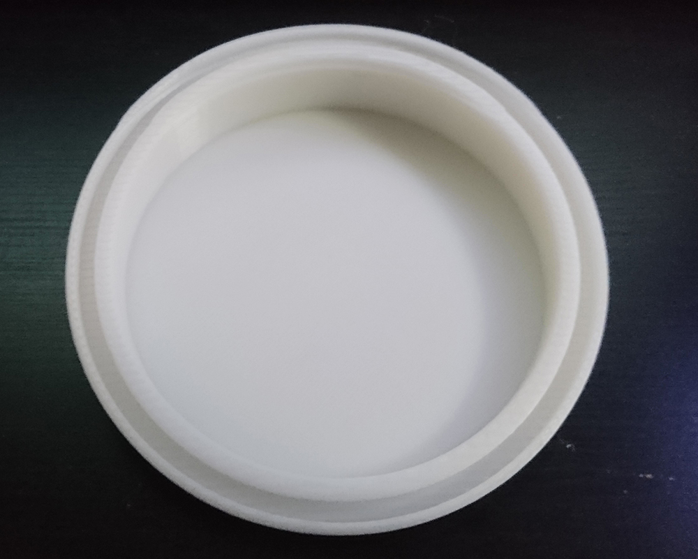
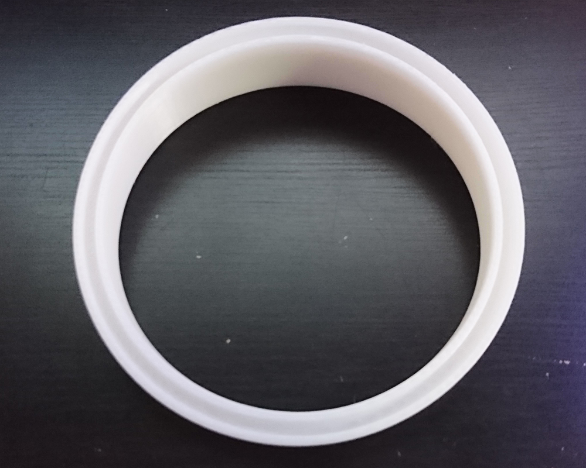
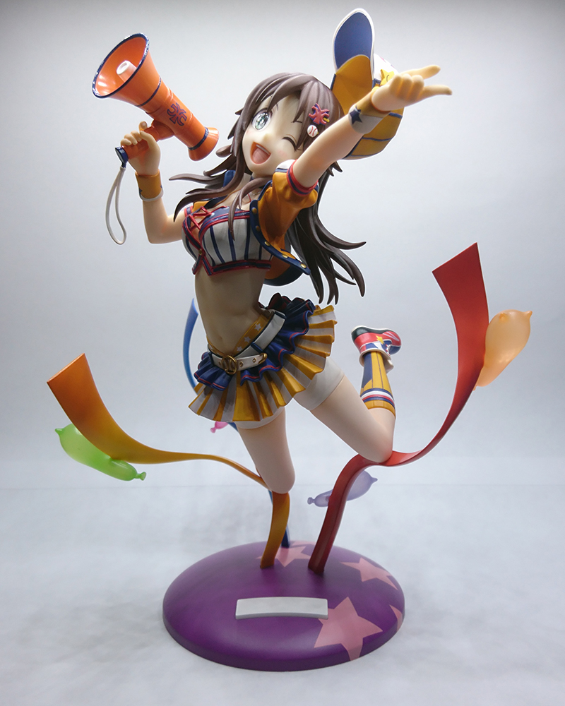
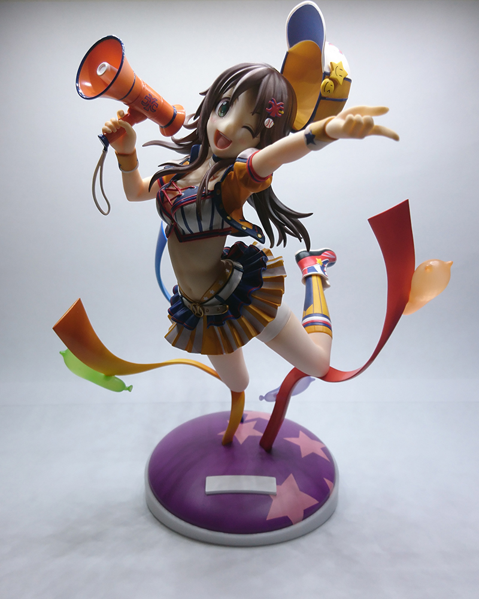

Right when I got my first printer, I felt like I could make anything and fix any problem that I run into. I think this the same for a lot of 3D printer owners, but I think it was different for me because I actually had things that I really wanted to make. My full-sized Future Tone controller needed a bracket for holding the touchpad and analog sticks, I had just gotten some new curtains in that used clips that couldn't attach to a curtain rod, and I wanted to start printing my keypads and making new keypads I couldn't make before when I was just cutting cases by hand. I was never into any novelty printing nor did I need any benchmark prints since keypads WERE my benchmark.<!--more-->

There did come a point where I ran out of "fun" prints, though. I think it's always fun to see your imagination come to life in the way that only 3D printing can provide, but there's something extra special about solving a problem that couldn't be solved in any other way (and isn't for work.)

I got this Yuki Himekawa figure last week and I really like it. The only thing is that she is angled upwards, meaning that if you look at it from any angle other than above it doesn't look right. I've run into this problem many times before and would either end up putting the figure on a lower shelf or I'd end up selling it. I was still thinking with the same mindset and ended up just leaving it on my desk. However, last night I came up with an idea while I was trying to fall asleep.

"Why not just print an angled base for the base?" Obviously this idea wouldn't work for any figure since the bases can get pretty crazy sometimes, but this one is just a simple circle so it should be easy enough. I opened up Fusion 360 when I woke up and quickly designed something. There's some extra plastic on the inside of the base to help support the streamers(?) so it needed to be hollow in the inside so they don't prevent it from going down all the way. Otherwise I just need to make a circular grove and cut it off at an angle (this was 10%.)

I put this one on and quickly realized how pointless and wasteful it was to have a solid bottom. It wouldn't help with stability at all and make it a lot harder to remove. The groove wasn't sized perfectly either so I quickly redesigned it to not have a solid bottom and be a little bit tighter.

And it worked perfectly! I really love this project because it was so easy and it fixed such an simple problem without having to modify the figure in any way. It doesn't look bad either, I actually think it looks kind of cool. It also looks closer to the original illustration!

 

Here's the illustration:

