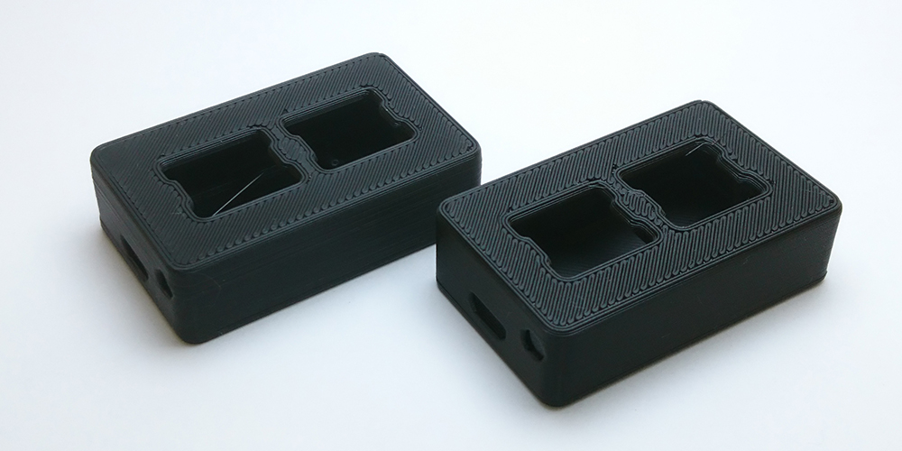
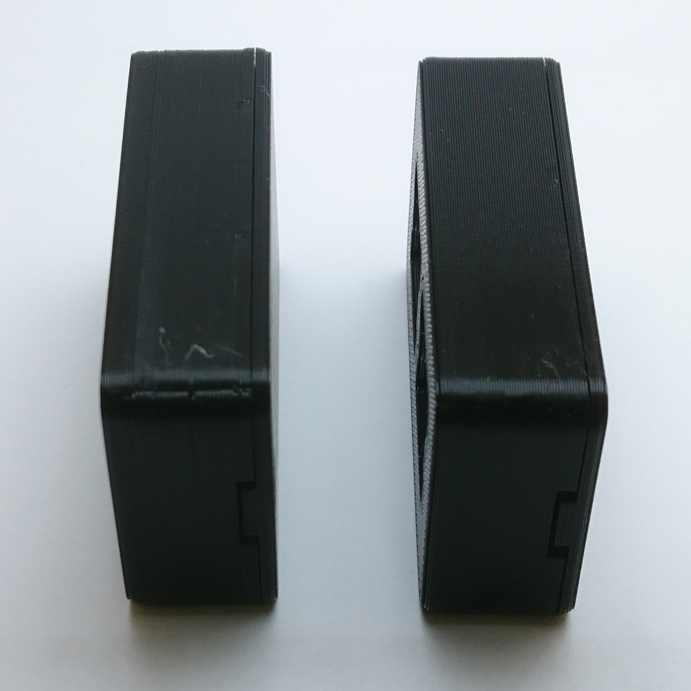
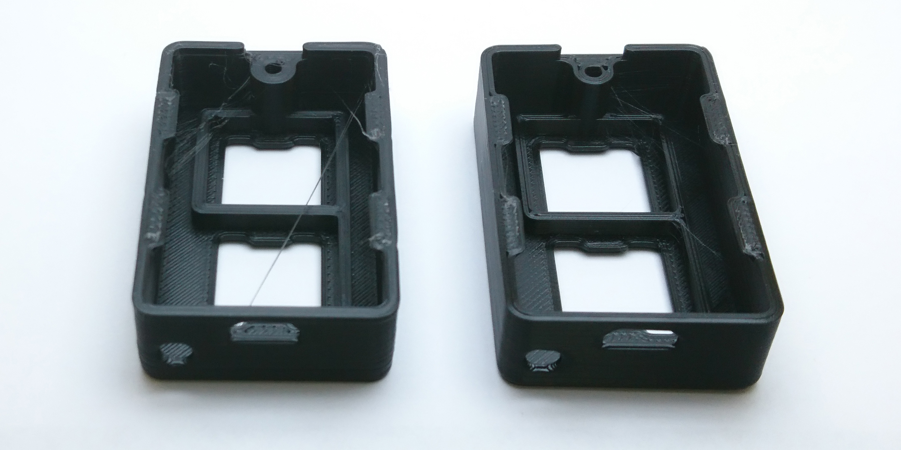
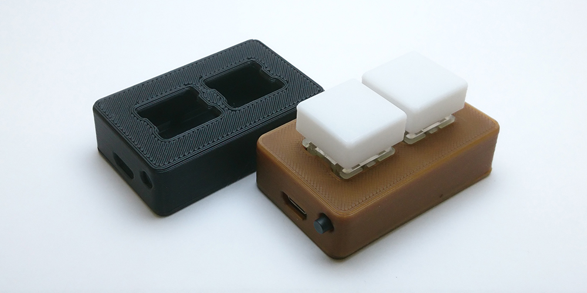

I've been content with the quality of my keypads for quite a while now, but since I built my Hypercube I've been trying out different settings to try to get consistent print quality. Amongst those was decreasing the extrusion diameter from .48 to .36mm, which in conjunction with a .25mm layer height gets prints done faster (3 minutes but faster is faster), looking a little bit better, and a little bit stronger.

<!--more-->

## From One Printer to Another

Though this configuration was originally made for my hypercube, it did teach me that you can reduce your extrusion diameter for higher quality prints without reducing your nozzle diameter. It won't give you the accuracy of a smaller nozzle if you're trying to print something small, but it also helps with retraction and reduces stringing since it reduces the pressure in the hotend.

## Bad Pictures

I got a new phone with a decent camera, but I'm not patient enough to be a photographer. Here are some pictures anyway! Old is left, new is right.

Here you can see the difference in side quality. The extrusion is much more consistent and the faster printing gives the finish a much more consistent look. The Z scar (where each layer starts) also looks much better.

You can also see two things in this picture. The walls are slightly thinner but without the over-extrusion that there was before. You can also see the reduced stringing.

## August Giveaway

I also printed this month's giveaway keypads using the same settings! I'm very happy with how they came out and think they are some of my best prints ever.

There's more info on the giveaway page here: [Gleam](https://gleam.io/competitions/e3NKx-august-limited-edition-osu-keypad-giveaway)
