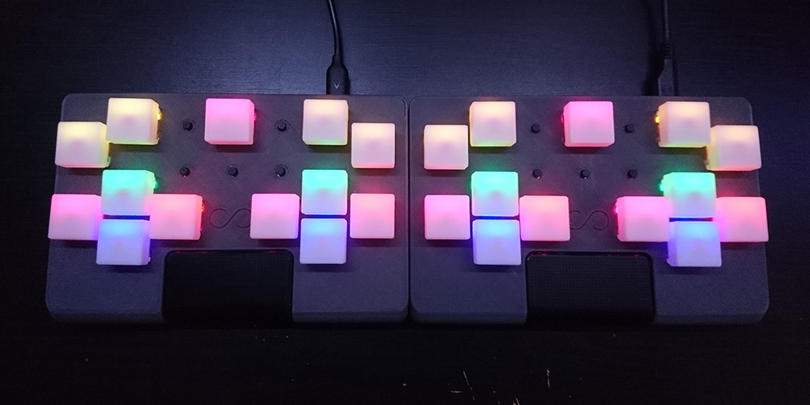

Hi all. It's been a log time coming, but the Future Tone controller is finally almost (95%) done! Now I have the original completed prototype and one with the fixed touchpad.

<!--more-->

## Touchpad hell

To be honest, the touchpad is the only thing that has kept this from being released for the past few months. The controller is actually relatively simple (though there is a lot of very arduous soldering,) but the actual mounting for the touchpad was a very difficult thing to get right. It needs to be supported in the front to prevent it from being pushed in and also give a satisfying click when pressed. After trying out a lot of supports and gluing the touchpad to a printed part, I ended up finally settling on adding a wall to the bottom of the case that prevents the touchpad from being pushed forward, since that was causing it to get stuck on my previous prototype. It required a lot of trial and error due to the odd geometry of the touchpad which made it very difficult to get an accurate 3D model of for reference, but after many prints and probably about 1kg of filament, it finally works perfectly!

_Seriously, this model is useless._

## Finishing touches to the firmware

There are still a few small features that I'd like to add to the controller before I say it's 100% complete. Things like brightness are currently locked at a certain value, but I'd like to make it a user setting like it is on my keypads (hold mode and press up or down.) I do think that a remapping feature could also be pretty cool, but that would also require me to change the wiring a little bit and I'm not sure if I have enough pins left to make the LR buttons remappable as well, so I may leave that out since this is a purpose-built controller anyway.

If you have any ideas for features that you'd like to see, please let me know via tweet or a disqus comment below.

## Vacation, more delays, I'm a bad person

I'll be on vacation for 6 days as of the 9th, so this will have to be put on hold yet again. As much as I'd like to put it up as soon as I polish off the code, there are still the logistics that I have to figure out. I'll be able to easily ship to anyone in the US relatively cheaply (it should be able to fit in a small flat rate box,) but I'll need to figure out exactly what to do for international customers in regards to shipping. I'll be doing this as soon as I get back, which will mostly just involve trying to get some boxes and find the cheapest option.
