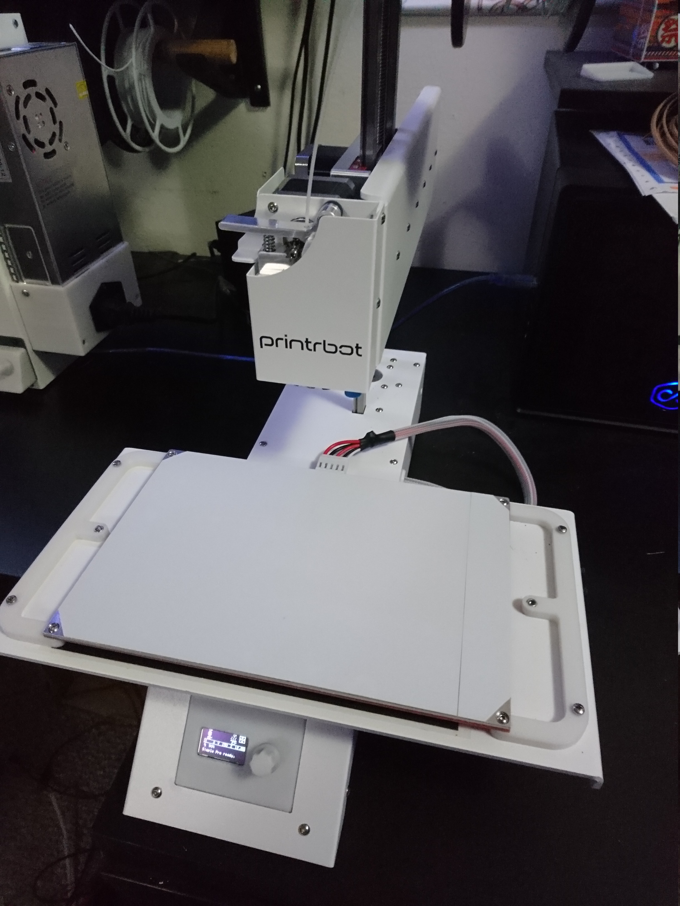
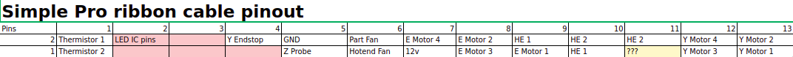
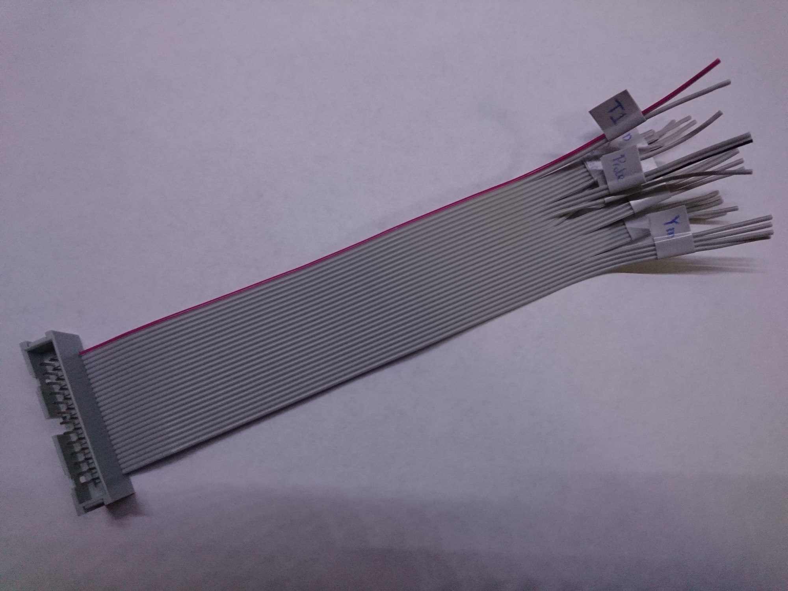

Last month there was a fire sale on the Printrbot Simple Pro. It was going for $185 down from its original $999 price tag (now $699 through Printrbot with the heated bed,) so I did the obvious thing and bought two of them. It features some amazing hardware with all nicely machined parts, nicely sourced motors, clean cable management, the Ubis 13S hotend, and Printrbot's great gear extruder. It also has a healthy build area of 215x150x200 mm, which is big enough for almost anything.  

<!--more-->

The software, on the other hand, is absolute garbage. To be fair, I knew that the Simple Pro was NOT designed for me. Though I believe it fails at even what it was trying to accomplish, I was determined from the start to make it work for me. My idea from the start was to swap out the electronics with an 8-bit board like the older Printrboard Rev F or a Mega+RAMPS, so my time with the Printrboard G2 (the main board inside of the Simple Pro) was mostly just me messing around seeing if I could get it to work.

Without getting too deep into it, the original electronics are awful. There's a mandatory OTA firmware update right when you power it on for the first time, which takes about 20 minutes and makes you think it died. Even after that update, you still need to update to a beta build of the firmware if you wish to print over USB. The updater is for Mac OS only and I don't have a mac, so I went on a several hour long adventure with a VM, a flash drive, and my laptop. Even after flashing the firmware, it's super jittery printing regular gcode files and you can change nothing except for the Z offset (which has to go in the start gcode.) It only worked with Cura and my extruder kept clicking, which is apparently a common issue and something you can't fix because you can't adjust the stepper current. Basically, Printrbot tried to stay ahead of the curve and move to a 32 bit board, but they just aren't ready for prime time yet. They tried to fix that with cloud software, but that made it even more nightmarish.

## Changing the electronics

Honestly, this was a pretty easy task. The X and X motors as well as the X endstop are already terminated regularly. Everything else uses the ribbon cable to connect to simplify cable management. It terminates with a simple 26 pin ribbon cable connector, so all I had to do was find the female version of the cable, cut it, and solder on connectors for the individual connections.

At the end of the Y arm, there's a PCB that breaks out the connection from the ribbon cable to all of the components. This is great because it means that replacing a single component is still very easy. It's also a great way to find the pinout, since everything is labeled. I got out my mulitmeter and made a spreadsheet, and started probing in continuity mode. If I hear a beep, that means that the two lines are connected so I just had to go through each connection and find out which pin it was on the ribbon cable. If there ware any common connections, it was either 12v or ground. If there's a common connection and one of them is on an endstop, that was ground and if it was on a fan, that was 12v. I'd never done this before but it was very straightforward and it worked on the first try!

After that there are just the small quirks of getting some things to work. The Z probe needed a mosfet to connect to the 5v signal lines, the hotend fan needed a mosfet to be controlled by a 5v signal line, and the LEDs needed their pins rearranged a bit and I had to solder a jumper to the PCB.

## Results

These are now my two favorite printers. I have two other Printrbot printers (the Play and the Simple) and they are both good, but the Simple Pro is built amazingly well. Printrbot builds amazingly sturdy hardware and I'm happy to have two additions to my arsenal. With a little bit of love you can iron out the problems with the Simple Pro and make it a great printer.

Lastly, a note to Printrbot. I would not feel happy recommending the Simple Pro in its current state to anyone. It'd be one thing if I could tell them to plug it in, download Cura, and go. What would I tell them with this? Connect the printer to your network, go to printrbot.cloud, hope your printer shows up as online, hope your model isn't too big, and hope it slices your file? There are alternatives. Hell, include a raspberry pi with octoprint and Cura can print to it directly. There's no need to reinvent the wheel and make it more complicated when your goal is to be simple. Simple also doesn't have to mean take every single option away from people. You guys make hardware that's too awesome to be ruined over something so pointless.
