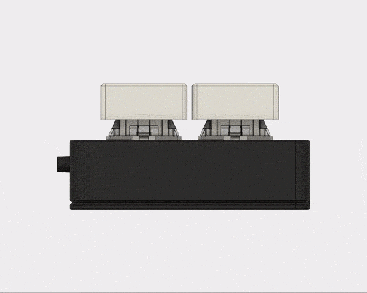
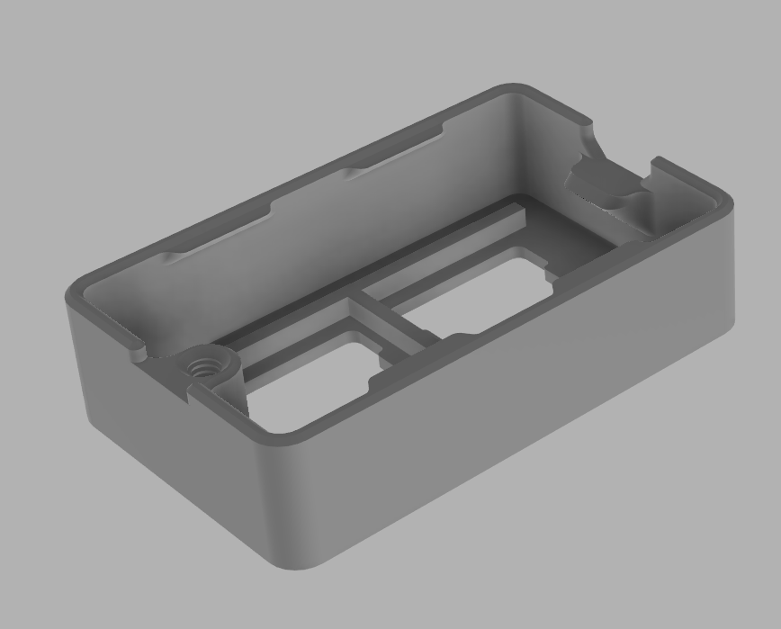
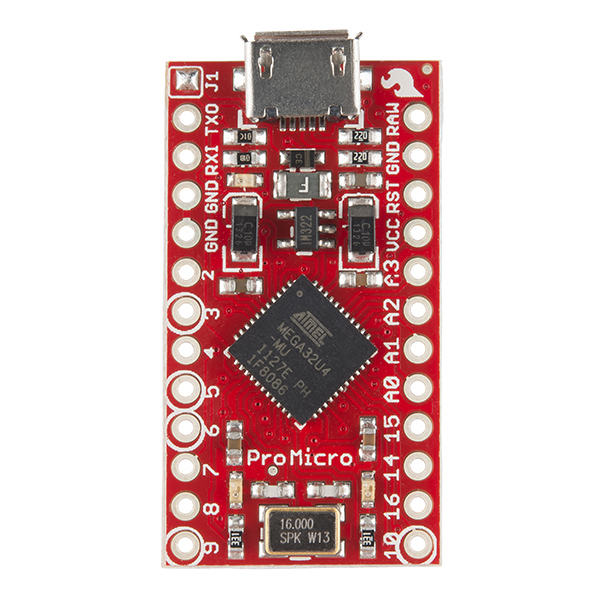
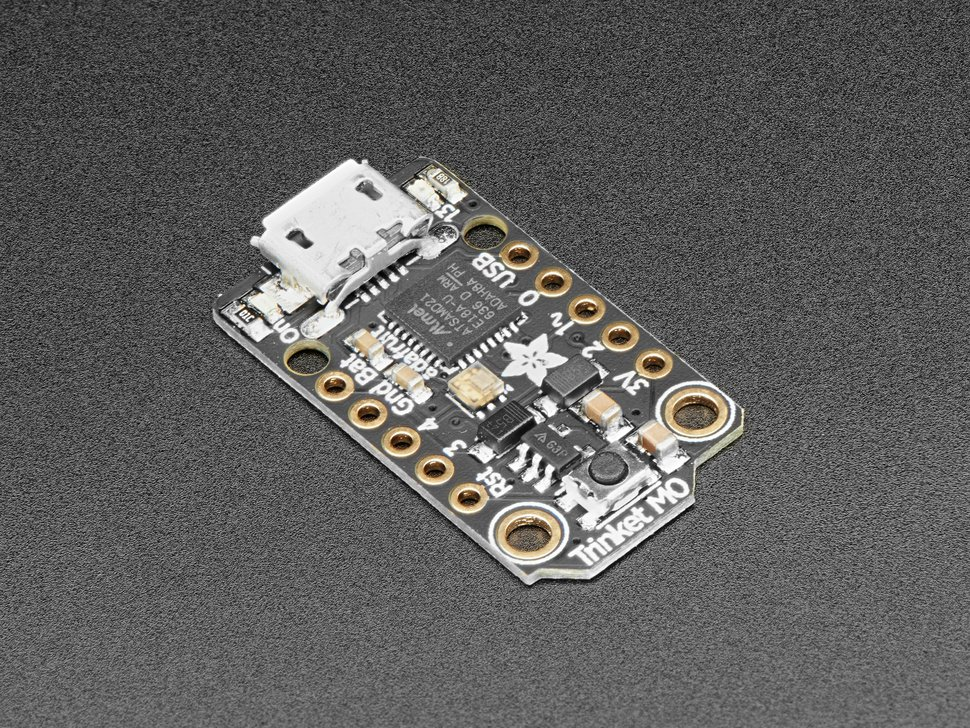
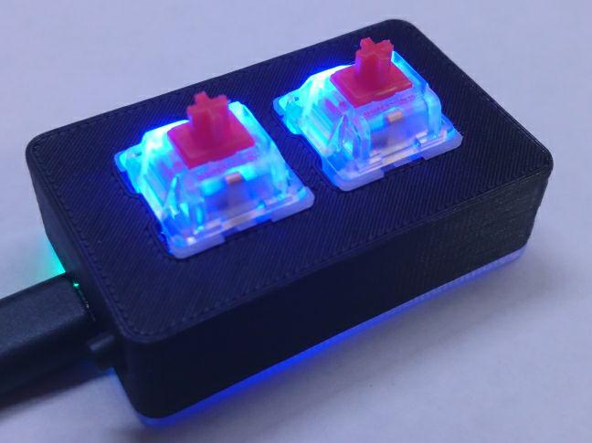

Last month, I decided that I wanted to remake the model for my keypads from scratch yet again, but this time with a special goal. I wanted to make a single 3D model with parameters for the key grid so I can use a single model for every keypad. This makes changing things a lot easier since one change will affect all models rather than me having to make all of those changes individually. I thought this would be quite the undertaking, since a lot of the features on the model seemed difficult to be updated. However, all it took was a little bit of extra thought and it was fairly simple. I got most of it done in one day and I've been printing these since I finished the model.

<!--more-->

More recently, I've been really wanting to change to a new control board for the keypads. The old Pro Micros I've been using work fine, but the ports aren't as securely attached as I feel comfortable with them being and they have a couple of quality-of-life problems for me. Adafruit released the Trinket M0 last year, which is a new version of their Trinket that uses a much nicer 32-bit ATSAMD21 microcontroller with support for all sorts of cool things like native USB (which is basically a requirement for my keypads,) a little on-board DotStar RGB LED, and CircuitPython. I tried it out briefly last year but didn't really put in the time to thoroughly test its capabilities, but since I really wanted to find a new board I tried again at the end of last month. I was very pleased with what I found and with a few simple tweaks of the model, my keypads now accept the Trinket M0!

## What's different?

For starters, I'd like to elaborate on the changes in the new model:

The switches now use the standard keyboard spacing of 3/4 inches (center to center, 3/4in-14mm from edge to edge.) This was a change I was always apprehensive to make due to tolerances, but having done it I haven't run into issues since the change.

The keypads are now slightly smaller by about 1 mm in the X and Y axes. The size may seem arbitrary, but it's actually very fine-tuned. The vertical height gives just enough space between the bottom of the microcontroller and the switches, the width gives enough space to the screw hole (and symmetry,) and the depth gives enough space to the side button (and symmetry.)

The bottom now receives a Trinket M0 rather than a Pro Micro. Not only that, but it accept it upside down. This allows for the reset button to be accessible from the bottom of the keypad through a small hole, so if you ever need to access it you don't need to open the keypad. It also allows allows the on-board Dotstar LED to shine into a clear bottom and the power LED to do its job without being blinding. It also ALSO allows the mounting to be entirely toolless with some modeled-in standoffs and a lip on the top of the case that holds the board down securely.

There are also some subtle changes just to clean things up. The bottom edge of the top of the case now has a slight chamfer to reduce the surface area of rubbing plastic, the screw hole is now threaded and some other minor fixes here and there to get it to print more nicely.

{: .center-image }

_This chamfer helps reduce friction which can compensate for inconsistencies between my printers._

## Why change to a new microcontroller?

### Micro USB and extra soldering

The way that the port is attached to a Pro Micro is... far from perfect. It's soldered to pads on the board, but it doesn't go through the board. This means that the force required to remove the port from the board is the same amount of force required to rip the pads off of the board. This isn't as easy to break as it may sound, but it does make the port less secure than it should be.

{: .center-image }

_Those two pads on either side are all that the port is attached to._

To make matters worse, they are barely soldered on from the factory. Some of the early keypads I shipped with these boards had their ports ripped off but pictures clearly show that it was the (lack of) solder that gave out rather than the pad being ripped off. Since then I've been reinforcing each port on every single keypad.

The LEDs are also ridiculously bright, and I personally think they look terrible inside of a keypad. They can't be controlled since they are connected to power and the USB lines, so I've also been removing all 3 of them. That means that I have to add solder to the USB pads (and not too much otherwise it will flow into the port) and remove 3 LEDs from each board. It's not too difficult but it's delicate soldering that requires time and attention and adds up to a lot of extra time.

### Overseas supplier

I've been getting these boards from China which can take several weeks. I also have a US supplier that's a bit more expensive, but I'd honestly rather not deal with it any more. It means I have to either order early in advance of stock depletion or order from both suppliers when I run out. Dealing with a company in the US is a lot easier since even free shipping only takes a week and fast shipping can get them to me in a day or two. US quality control also helps put my mind at ease since the microcontroller is a point of failure in the keypads, meaning my keypads are only as good as the microcontroller inside.

### Trinket M0 to the rescue!

The ATmega32U4 on the Pro Micro is a relatively old and weak chip. For this application it really doesn't matter too much, but I'd like to give my keypad more room to grow and the ATSAMD21 on the Trinket M0 provides a lot more wiggle room. It supports MicroPython/CircuitPython out of the box, it's a lot faster, and though it lacks EEPROM it supports EEPROM emulation through its flash.

{: .center-image }

_The four connections for the port are through-hole._

The port on the Trinket M0 is soldered through the PCB, making a much more secure connection. When I was using the original Trinket a few years ago, I didn't have a single instance of port failure, so I have a lot of faith in Adafruit and their part selection.

I also love the on-board DotStar (RGB) LED! This should allow me to add some simple LEDs to the basic model if the bottom is clear, which I'm thinking about doing for all color choices, meaning even if you order a black keypad the bottom will still be clear. If I do this, I may completely phase out the LED model since it feels redundant at this point.

#### Note about CircuitPython

CircuitPython is fork of the MicroPython project, which allows you to program your microcontroller with Python. It's incredibly cool and the implementation on the Trinket M0 is even cooler. Rather than having to use an IDE, the Trinket mounts itself as a simple flash drive. All you have to do to edit the code is open the python file on the drive with a text editor and save it and the code will update in real-time.

As cool as this is, the overhead on the microcontroller is far too much for a keypad at the moment. Using Arduino, the code is able to run 32000 times per second vs ~20 times per second using CircuitPython. As great as it would be to be able to edit your button mapping by changing a single value in the code and just pressing save, it's not worth the performance loss. I'd like to revisit it further into its development when the overhead has been reduced, but until then I'll be continuing with Arduino.

## Shop Changes

For now, I'm planning a few changes. Because I believe the RGB LED that's now included in the basic model actually adds value (and these boards cost me about twice as much,) I want to increase the price of the basic model by one whole dollar. It's still a loss for me financially, but hopefully I'll be able to make up the difference in the time I save from not having to add solder to the USB port and remove LEDs.

{: .center-image }

_The underglow is from the DotStar LED (though a little dim, I still have to tune the brightness.)_

I'm also thinking about removing the LED model. It may just be a temporary, but there are a few downsides to the model. I never liked how the light from the LEDs looked because they're just too bright, it uses more pins than the RGB model and requires almost as much soldering, and the LEDs prevent the switches from being opened, which introduces needless inconsistency across. It's also another two listings on the shop (for the regular and wide versions) which feels more like clutter than anything else.
