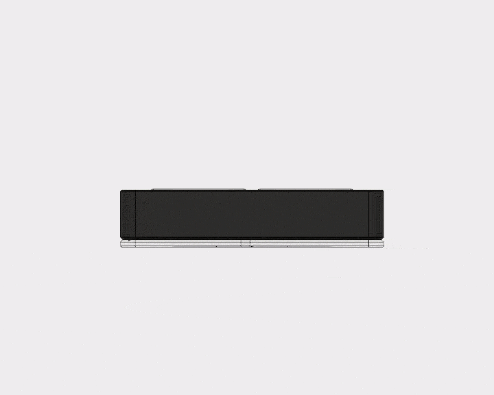
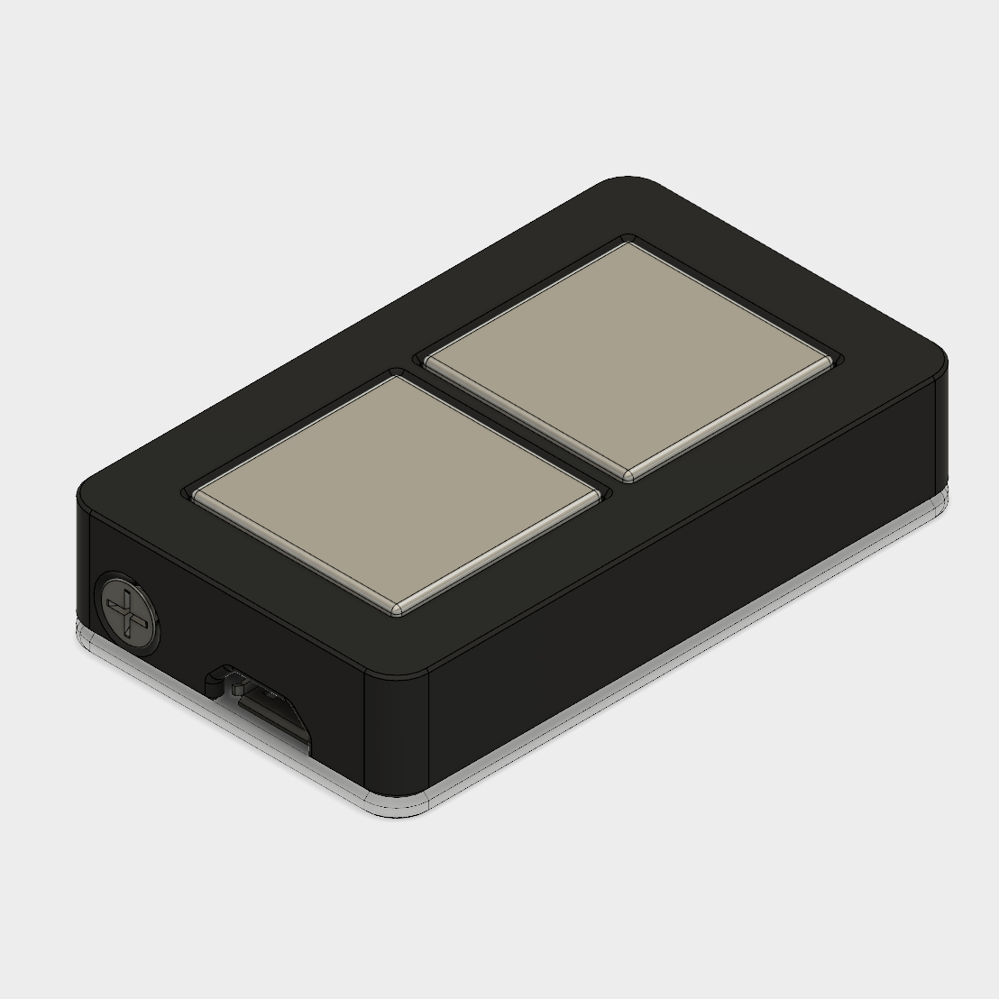
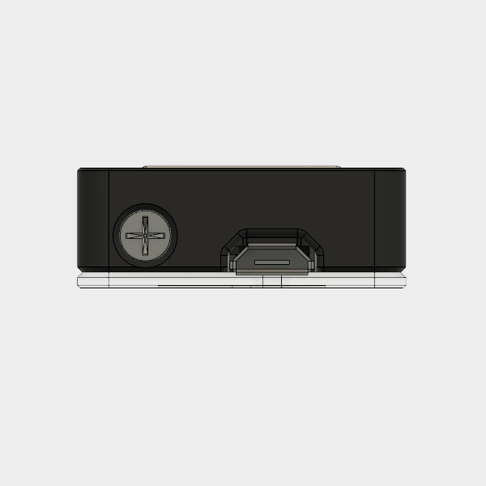
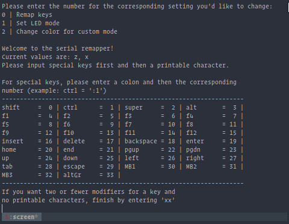

Everyone give a nice, warm welcome to the newest addition to the keypad family, the 7K-- sorry not yet. It's the Touch osu! Keypad!

<!--more-->

## Why touch?

For the past year, I've been really into mobile rhythm games. It's a long story of a long road to get to that point, mostly involving me being tired of feeling like every paid rhythm game was $60, required a special controller for another $40-130, had a few extra songs as paid DLC that were ridiculously overpriced, and then were abandoned (I'm looking at you, SEGA.) Playing games like CGSS and Garupa felt like a breath of fresh air. They are all free, have new songs added once every 1-2 weeks, and they all have gatchas that definitely don't prey on people's psychological weaknesses at all! I think these games are actually pretty similar to osu in that they are free and have frequent new songs, with more quality over quantity and less of being in a legal grey area (minus the gatchas.)

I actually tried making a cap touch keypad years ago (it should be somewhere in the osu thread) because I live in an apartment so noise is a bit of an issue, and I slam down on my keypad like my fingers weigh 50 lbs each. I didn't put a whole lot of effort into that prototype (it was on a breadboard) and it was using cap touch PCBs that kind of sucked, so I wrote it off at the time. Since getting the extra parts I needed for this newer design didn't cost me too much, I figured why not give it another go after getting so used to touch controls on my phone. I've also been trying to play more osu! lately and I took for granted how nice it is to be able to play a rhythm game and not wake up the neighbors.

## Why now?

I was having a fun evening reading through the Trinket M0's documentation when I noticed that it said three of the pins support capacitive touch. It's actually using a technology built into the ATSAMD21 called Q-Touch that eliminates the need for any external components. All you need to do is touch or connect the pin to another piece of conductive material using a wire and you're good to go. This is really useful for me since I don't want to either make room inside of the housing for passive components nor do I want to use a PCB since that would complicate things even more, so this does a great job of keeping everything nice and simple.

## Design challenges

The first thing I wanted to figure out was how I wanted to model the case. For the initial prototype, I just glued the metal plates to the top of one of my regular keypads to test the concept. Since it worked, I looked at the whole model and thought about how best to optimize it. Ideally, all of my keypads would be as slim as possible for ergonomics so you don't need to bend your wrist as much, so I first tried to rearrange where the parts went internally. Since this model isn't using switches, I was able to reduce the height of the top of the case by quite a bit since I didn't need to accommodate for the bottom halves of the switches being on the inside of the case. It was actually a pretty easy design change to get it just as tall as it needed to be to fit all of the components inside.

The second challenge was that once the design was mostly finished, how would the two halves lock together? I purposely made the halves slide together very snugly, but that's not enough to keep it from accidentally sliding apart. On my other models I use a single screw through the bottom to lock the sliding mechanism, but that wouldn't work on this model since the screws I use are longer than the keypad is tall. I then had the idea of putting the screw on the side, but since the only place it could reasonably go was where the side button was. Then I got to thinking: the screw was metal, the top plates were metal... why not try to make the screw into a cap touch side button?

This actually worked surprisingly well on the first try, but it was a little too easy to hit the side button since your ring finger naturally rests around that area when playing. I thought that moving it to the front of the case could rectify that and you could instead press it with your thumb, but it was ugly and difficult to reinforce that area of the case, so there were some unpleasant cracking sounds when it was screwed in all the way (which was the screw post breaking.) After a lot of thinking, I finally settled on putting it behind the USB port instead of in front of it. This means you have to reach ever so slightly with your ring finger to touch it, making it still have the same convenience as the original but also more deliberate so it's almost impossible to hit it on accident (unless you have really long fingers.)

The third challenge was the code. I've been thinking about this for a while, but I don't really like how the side button on my keypads doesn't really function as another key, but instead has a contextual function. Holding for x presses and releases a key, holding and releasing after y changes something, and holding and releasing after z changes something else. Anyone can figure it out with enough time, but it's fairly unintuitive and I don't expect EVERYONE to read the documentation, so I'm sure some people have been surprised to see that their LED mode changed when they held down the side button.

Though I don't think relying on software is any better in terms of ease of use, there are a few advantages to adding these features into the remapper. It will free up the side button to function just as a normal key, it will keep people from accidentally changing things that they didn't mean to change (which nobody's ever told me about, but I can't imagine there'd be that much overlap between someone who wouldn't read the quickstart guide and someone who'd message me,) and the remapper itself can explain what you're setting, like telling you a little about each LED mode. I'd like to eventually replace Termite with my own program for setting everything, so I think this is a good step in that direction. Settings are still saved to the keypad so I think this is a positive change. At the very least, it doesn't require any proprietary software so I think it's good for the time being.

If it does prove to be problematic in the future or people generally don't like it, re-adding side button support isn't too much work. I definitely feel a lot more reserved when making changes to my keypads now since I feel like they've been working so well, but I believe this is an improvement so I decided to go for it.

## The result

I think that what I ended up making is super cool. It's slim, doesn't have anything sticking out of it, uses minimal parts, and has cool lighting effects just like all of my other keypads. Since it's smaller, the single RGB LED does a much better job of illuminating the housing so if you get it in clear, it's like an RGB keypad with a single LED.

## What's next?

I have two more products planned for the future. One for the near future is the 7K, which is mostly waiting on some code changes and optimizations. Expect another post about this model within the the next few weeks.

The other one is a 4K version of the touch keypad. The wider version introduces some structural concerns and it also requires a different board since the Trinket M0 only has 3 cap touch pins. I'm planning on using the ItsyBitsy M0 but not until PlatformIO officially supports it since it's been a bit of a pain for me to program and that's something I absolutely do not want to pass off to my customers as well (for anyone so inclined or just in case anyone has issues that require firmware updating or reflashing.) They just added support for the ItsyBitsy 32U4 which I'm using in the 7K model, so hopefully support will come soon.

## Giveaway

Lastly, since the May giveaway ends tomorrow, I'll be selecting the winner and putting up the new giveaway. To celebrate this release, the Touch osu! Keypad will be this month's keypad. Please look forward to it and enter May's giveaway if you haven't already and are reading this on the day it was posted!

[Link to last month's giveaway featuring a blue and pink MacroPad](https://gleam.io/competitions/1oHsd-june-limited-edition-pastel-macropad-giveaway)
