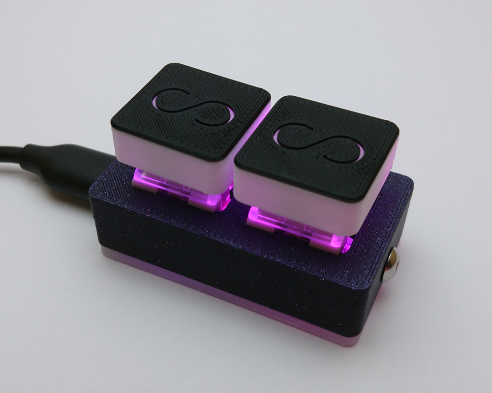
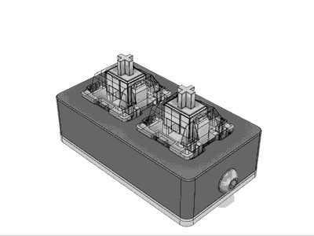

Hi all! Sorry for not posting as much as I'd like to, but I've been hard at work trying to balance order fulfillment and development. I actually have a few half-written posts that I never published, so I'll try to include as much of that in here as I can.<!--more-->animation

### New models

I released the MegaTouch a few months ago and I think it's been pretty well received. I also released the 7K model which has sold about as I expected it to considering its price (and the number of 7K mania players out there.) I would like to make some changes to the 7K model at some point in the future since I don't think the design feels quite as streamlined as I'd like. I've gotten some people telling me that a double spacebar would be better and I agree since a double-wide single key works okay, but two 1.5x keys would work better. (Most) people have two thumbs so I think that's worth taking advantage of. It also feels larger than it needs to be, so maybe I'll find a way to slim it down a bit more.

Coming soon (hopefully early 2019) will be the 4K MegaTouch. The design is done but I'd rather hold out on the release until the shop dies down a bit so I have some more time to work on the code.

### New revisions to touch models

While I was designing the MegaTouch, I realized that the sliding mechanism of my keypads wasn't necessarily the only option. The big limitation I had (and why the touch models originally had so much padding around the edges) was that the screw needed something on the bottom half of the case to screw into, so it needed to be as wide as both the microcontroller and the screw post. However, the sliding mechanism would only work with the USB port and side button on the same side, so I had to come up with another solution.

What I decided on instead was making the top and bottom pivot into each other from one side and get secured with a screw from the opposite side. This requires tighter clearances but works just as well, if not better than before. The touch models are now able to be as tall as the screw post on the bottom half of the case is. I also made the bottom slightly thicker to make the whole thing more rigid.

The padding could still be smaller, but since I am not a masochist, I kept it big enough to not run into any issues when 3D printing the cases. Ideally I want as much surface area as possible to come in contact with the build plate and prevent it from coming loose while printing. Any less than there is now and I'd undoubtedly try to print 3 at once and come back to plastic spaghetti in an hour from one coming loose, making a blob of plastic on the hotend which knocks the other two over, and creates a huge mess. Printability is another important aspect of design and I think I have a good balance with where the keypad's at now.

## Plans for 2019

There are a few big changes that I'd like to make at the start of next year.

#### Mechanical Keypad Redesign

Since I made my revisions to the touch models, I've been thinking I'd like to give a similar treatment to the mechanical models. The biggest changes include:

##### Shrinking the keypad and replacing the side button

This is pretty easy but basically requires a full redesign. Keeping track of features in Fusion 360 is kind of a pain, so it often makes more sense to start over from scratch than it does to try to suppress or delete features and replace them with the ones that you want.

##### Making switches actually hot-swappable

The switches, as they are now, are not hot-swappable. You need to open the switches and replace the internals which is cumbersome, prevents all switches from being compatible, and leaves more room for user error if the top half of the switch is put back on backwards, at which point the bottom half would need to be replaced and resoldered.

My plan is to keep the design close to what I've made so far but make a PCB that the switches can connect to which is also connected to the microcontroller. I think I can try to keep it simple and make one and two key variants at the beginning and connect the single and double boards together with a ribbon cable for the wide and 4K versions (or just have them able to break-away from each other with the proper spacing, but they could easily be soldered together for a 4K version.) It's just a mess in my head right now but I'd like to bring it to fruition as soon as possible.

#### Merging codebases

Maintaining code for the regular models, the macropad, the 7K keypad, and the touch models has been a challenge. Adding features means I basically need to do it manually for every model. This is mostly because it's a lot easier to change the code and make it work for one model than make code work for all models simultaneously, but I'd really like to put in some effort into this so I can do things like allow LED modes to be changed via the remapper for all models (or with the side button as well.) With capacitive touch coming to the mechanical models for the side button, I'll have to implement a lot of the touch code into the mechanical code anyway so I think this just makes sense from every angle.

#### Dedicated remapper utility

I've been recommending Termite for handling serial communications with keypads, but the config file doesn't load for a lot of people and it's just not as clean of a solution as I'd like. Next year, I'd really like to make a nice GUI remapper that's simple and painless to use.

## 2019 Preview Giveaway

You know all of that stuff I just talked about? Well, I got some cool switches and I wanted a keypad to put them in, but I thought a regular 2K RGB keypad wasn't cool enough, so I made a quick proof-of-concept of what I want the keypads to be next year and got it working! As seen in the first picture and animation above, here it is printed in cool proto-pasta purple sparkly filament.

There's obviously no hot-swapping yet but this is quite a bit smaller and features the touch-sensitive screw. This was just to see if a smaller keypad like this would even work in the first place and I'm very happy to report that it works perfectly and this seems like the direction I'd like to go into for faster prints, better portability and ergonomics, as well as improved aesthetics. The button head screw also looks great since it actually looks like a button, compared to the countersunk screws I'm using now.

#### Dealing with Gleam

I think Gleam has worked out pretty well for me so far, but it's been bothering me as of late. I've had a lot of people enter that clearly don't play osu or are even interested in getting a keypad specifically, they just blanket enter every giveaway they can find. If one of these people are selected, I will re-pick the winner until I get someone who I can tell is actually entering because they care (meaning I don't see a bunch of retweets of completely random giveaways on their twitter.)

My current idea for a solution is just to use Google Forms, even if it's just temporary. You'll still enter normally through following and/or retweeting (follow is required so I can DM you if you win,) but you'll manually add the ways you entered and it'll have a separate box with a simple question like "What's your favorite song to play?" The response needs to be legitimate but otherwise has no bearing on your chances of winning, it's just a bot-check type thing, except the bots in this case are greedy people.

## Vacation

The last thing I'd like to talk about is my vacation that starts on the 26th of December and lasts until January 8th. I'll be in Japan for almost two weeks to do some fun things and relax for a bit, since I haven't really had a break since last summer. I'm staying a station away from Akihabara and I'm going to be going to Comiket and hopefully some fun New Years stuff.

#### What about the shop?

My original plan was to pre-make a bunch of keypads and sell them without any customization options (since I obviously can't make them while I'm gone and an almost two week lead time would really suck, especially for people who are buying stuff with Christmas money.) However, I have a pretty huge backlog right now and getting through all of my current orders while simultaneously making a bunch of keypads for while I'm gone seems like much more of an undertaking than I originally anticipated and I don't know if I (or my printers) will be able to keep up. I'll tweet about my final plans before I go but I would like to have something up on the shop, even if it's just a bunch of basic and touch keypads since those are faster for me to make.

## Other projects

I've spent some time working on other small hobby things this year that I'd like to post about since they still relate to development, so I'll try to get those up within the next few weeks after I get back. Stay tuned!
