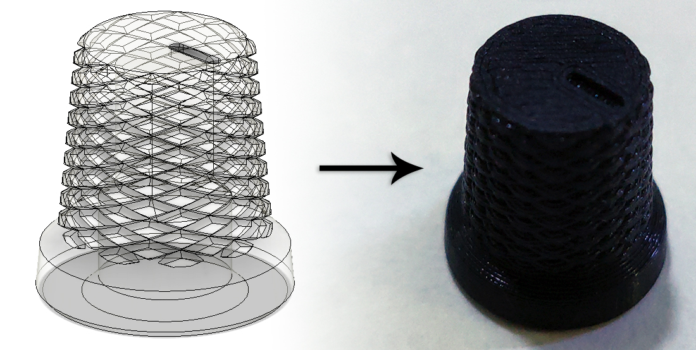
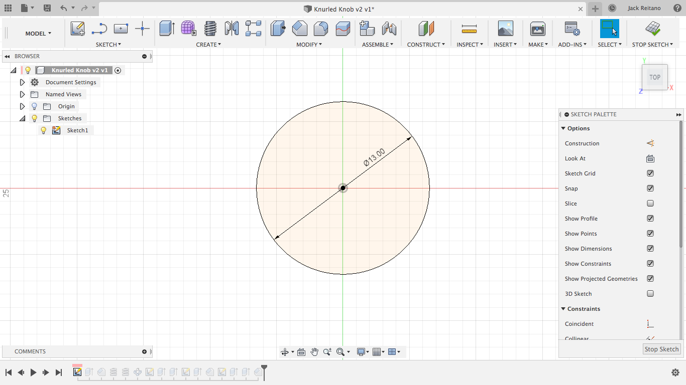
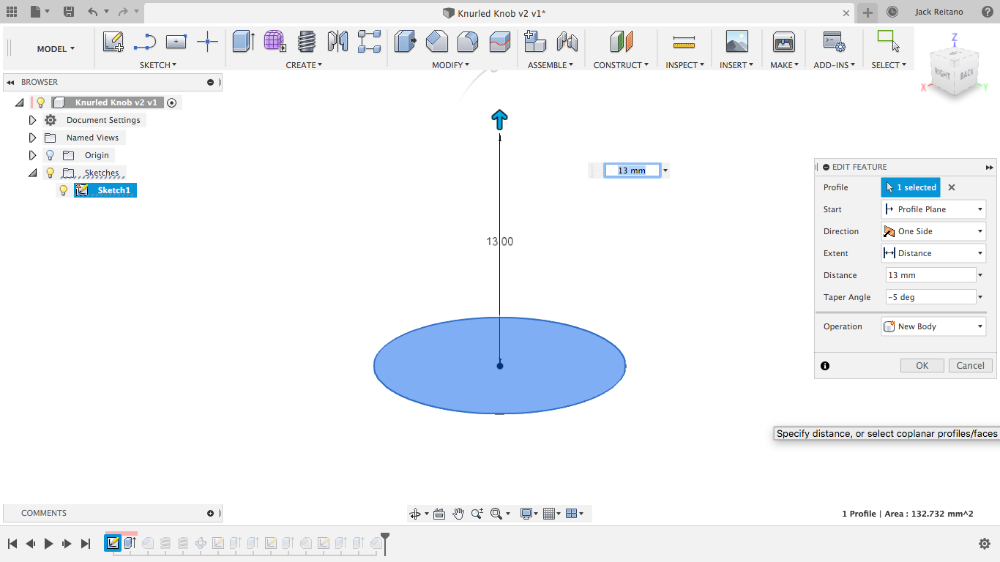
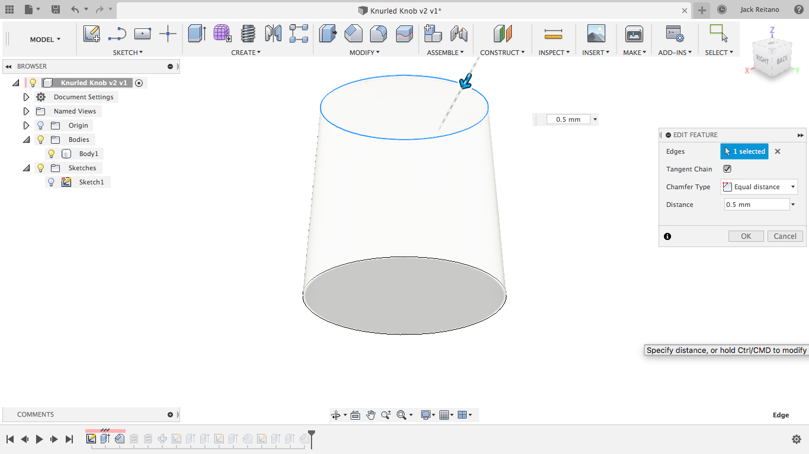
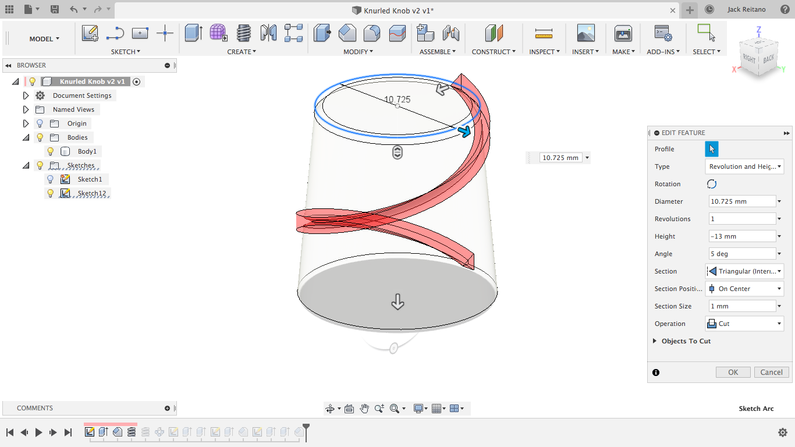
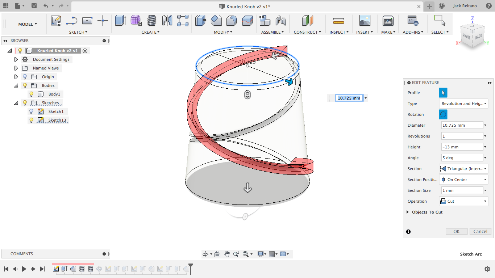
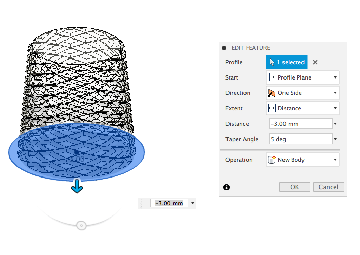
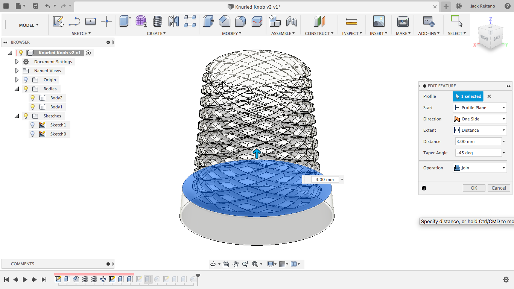
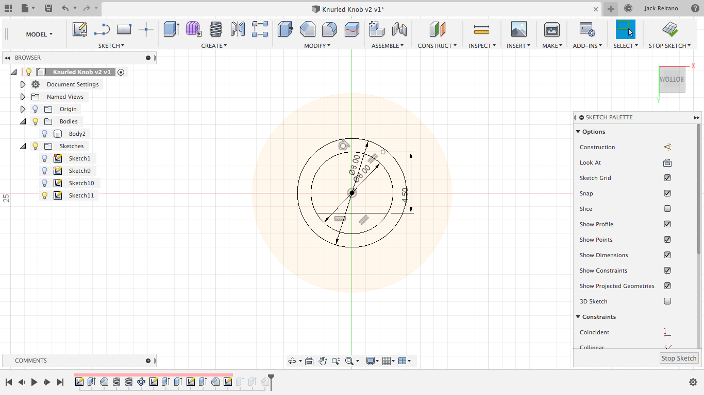
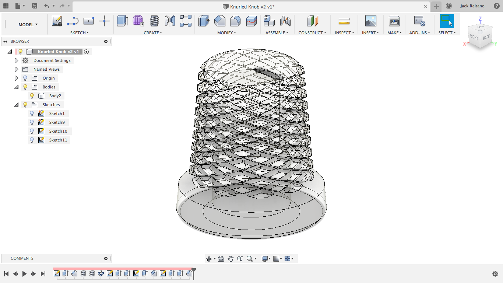

I've been wanting to write a fun post about something for a while, and though it's apparently been half a year since my last post, I'm happy to be writing something. Today's subject is the order of operations when modeling in Fusion 360. This can be an issue for people who are new to modeling, so I'm going to describe how I made this simple knurled knob since there were a few ways I could have gone through it. The features used here aren't specific to this model, so if you're trying to get into CAD but aren't trying to make this exact thing, this should still help you.

<!--more-->

The important first step is to try to think as far ahead as possible to avoid problems. This isn't totally necessary, but as you'll see later, it reduces the number of features required. Ideally this wouldn't be required, but Fusion can get bogged down pretty quickly and thinking about this kind of stuff can help keep designs be much more clean than they otherwise would be and make future edits less of a chore of waiting around for Fusion to recalculate features. I'll explain it as I go along, but for now I'm starting the model from the bottom of the part of the knob that will be gripped.

## Making the top part of the knob

Create a new sketch and make a circle of the desired diameter. This is the size of the bottom of this part and I'm going to be tapering it, so be aware of that if you're following along and don't make it so narrow that it'll either be too uncomfortable to use or too narrow to fit the shaft of the encoder. 

Next is an extrusion with a taper angle of -5 degrees. This is simpler than using a chamfer because you don't need to reference the height and diameter since it's spanning the entire height of the knob. I'm extruding by 13 mm because I want the final part to be 16 mm tall, leaving 3 mm for the bottom part. We'll be using the taper angle a few times, so you can set it as a custom parameter, but I'm just going to type it in every time because this is a small part. 

This is when you have to think about your order of operations. It's going to be really annoying to try to add a chamfer to the top of the knob after the knurling, so it makes a lot more sense to do it first. This is also where the timeline feature of Fusion can be an absolute godsend so you don't need undo a bunch of features just to add the chamfer. I'm using .5 mm on the top since I'll be printing this upside-down and I'd like to maximize the surface area that's on the bed, and I'm just trying to make a clean edge on the top.

Now comes the knurling. Many other people have already gone over this and there are countless guides on Youtube of slightly differing methods. All we do is use the coil tool with one revolution, do it again but flipped, and the use the circular pattern tool to repeat it until the desired effect is met. I'm using center triangle for the coil with the section size twice as big as I'd like it cut in because I get some extra material when I use inside triangle (this is just a f360 quirk.) Remember to add the taper angle here or the coil will go stright through the body.

## Making the bottom of the knob

This is where the starting position helps a lot. Now, all I need to do is make a new sketch from the bottom origin plane and make a circle of the desired width. Then I'll extrude it with the same taper angle again to keep it nice and consistent, but I'm going to make a new body instead of using join. This is for the next step.

Now the chamfer between the two sections is actually dead simple. Instead of shortening the top by the chamfer distance, making the bottom taller, and then adding the chamfer to the outside edge and guessing how far it needs to go in, all we need to do is extrude up with a -45 degree taper angle and use join. This will combine the two bodies and create the perfect chamfer, no guess work required.

## Making the shaft hole

This part's pretty simple, but can be tricky for people just starting out. I took three dimensions for this with my callipers: one for the shaft diameter, one for the thickness between the flat of the shaft and the outside diameter, and one for the thickness of the threaded part plus about a millimeter for clearance. Use the shaft dimensions directly for a snug fit. Trying to add clearance for the shaft will result in a knob that's too loose. To sketch this hole in the part, just create a circle using the diameter, a flat using a line, and then use the line tool again to make a tangent line on the top of the circle that's parallel to the flat on the shaft. Then you can use the second dimension you took as the distance between the two lines. Make the top line a construction line and then add the second circle with the thread diameter concentric to the first one. 

From here, just extrude the inner shaft down as far down as you'd like the knob to go and then extrude the outer circle enough for it to clear the threads. Lastly, I added a chamfer to the bottom just to make it look a little cleaner and I added a small groove to the top as an indicator. And there you have it, a knurled knob for a rotary encoder.

This is a pretty simple model, but I wanted to make this post to help people avoid the common pitfalls of modelling in Fusion. I've personally never been the type of person to sketch something out before I model it, and I'd even rather just model something twice for the experience, so putting some thought into the design before getting started helps me quite a bit to keep the features to a minimum.
