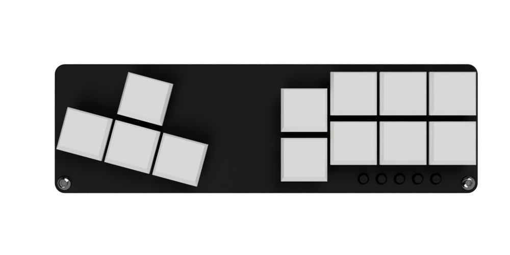
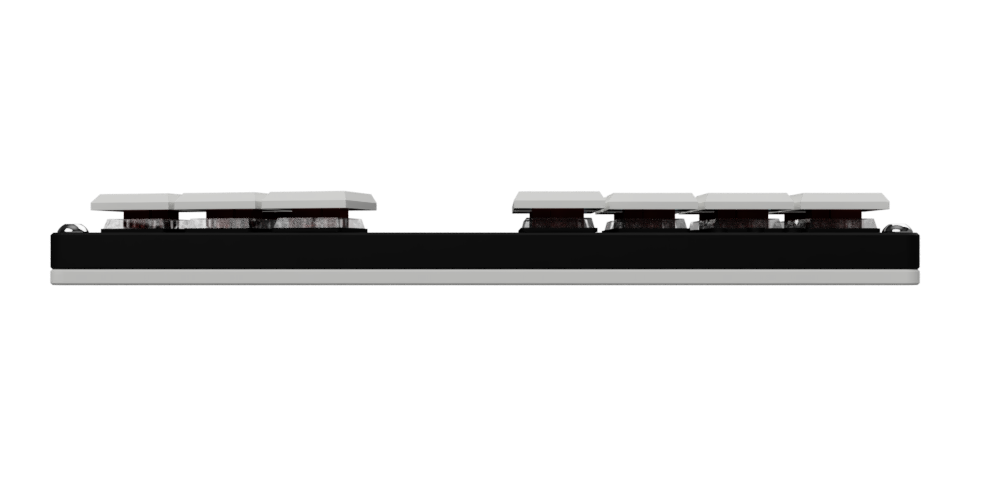

I was originally planning on including this in a large summary post, but the development has taken a bit longer than I anticipated, so I'd like to take this opportunity to go more in-depth with my new controller:

<iframe width="560" height="315" src="https://www.youtube.com/embed/RqWzqG6DqxQ" frameborder="0" allow="accelerometer; autoplay; encrypted-media; gyroscope; picture-in-picture" allowfullscreen></iframe>

<!--more-->

## Excitement

To be honest, it's been a long time since I've been this excited about making something I was planning on selling, probably since the Future Tone controller, but even that took so long due to all of the Playstation specific BS that I definitely wasn't having fun by the end. I've been actively playing DOA6 since its release and, though I'm not much of a competitive player, I'm still having fun with it. I've found that the controller has helped me pull off a lot of things that I was having trouble with before (it's embarrassing but I found quarter-circles and holds to be really unreliable on the Dualshock 4 and Xbone controller.) I honestly think this is the most time I've put into actually using the controller in development since the original 2k keypad, and I'm having a lot of fun making minor improvements and figuring stuff out.

The goal of my shop when I started as this: Make things that I want and can't buy available to anyone else that wants them. I could buy a hitbox or similar fightstick, but I want something small and low profile and I really feel like this is the no-compromise solution I'm looking for. I have enough stuff-- I don't want a big controller as a centerpiece when I'm not using it. This is small and comfortable so I could use it at home and it won't take up a crazy amount of space or I could stick it in a bag and play on a laptop anywhere. I do my best to make all of my keypads as portable as possible, but I think this design really worked out and is as portable as I could have hoped it would be. 

## Keyboard vs gamepad

I originally had the controller set up as a keyboard, which worked well enough. However, I like to use Steam Big Picture mode since I don't have a mouse and keyboard plugged in most of the time (don't ask, it's complicated,) and that made it impossible to do simple things like launching the game and even inviting a friend to a lobby while I was in-game. 

I then tried switching to the [Joystick library by Matthew Heironimus](https://github.com/MHeironimus/ArduinoJoystickLibrary). Originally I tried to map all keys to sensible buttons, but I quickly realized that I could just map the buttons through Steam, which also allows for much more flexibility in mapping and saves me the pain of writing any additional remapping code. 

### Why not both gamepad and keyboard?

I think this may end up being what I do with the final model. There's no reason that this controller should be specific to DOA. If other games have better support for keyboard controls, then I think it would be a valuable feature along with mapping profiles similar to what I have on my [MacroPad](https://shop.thnikk.moe/collections/6-key-keypads/products/macropad). I can also allow for the shuffling around of the gamepad buttons, but I think it would be simpler if I left that up to Steam.

### What if I don't want to use Steam?

This is a question I will address at some point in the future, but even though the hardware may as well be final right now, I feel like there will still be some time before its release due to the amount of testing I'd like to do. I'm not even sure if there's a DRM free version of DOA6, so since it's the primary game I'm designing the controller for, not relying on steam is a low priority.

I'm not going to get into a big thing about Steam being DRM mostly because I think features like their controller remapper are an absolute godsend and really do make up for many of the problems you may otherwise have with it. That and [Proton](https://www.protondb.com/).

## Console support

To be honest, with my experience in making my Future Tone Controller (Link), this is a very expensive and time consuming rabbit hole I'd like to never jump down again. Padhacking a Dualshock 4 sucks and relying on a third party board to work when Sony actively tries to prevent them from working is just as bad. Not only that, but $40-50 for JUST the electronics of a controller isn't something I enjoy trying to keep in stock, even if it's just a few. 

Even if I'm getting 1/100th of the customers I could be getting if I sold a console version of the controller, Sony has made it such a miserable experience and II refuse to support a company that's working against me. As for Microsoft, I don't even own an Xbox One and I don't plan on/have any interest in buying one. 

## Design

The design of this controller actually took me a bit less time to figure out than I was expecting. I had an idea in mind from the start of exactly I wanted it to look like, and though it's arduous to do certain things like design holes for the how-swap sockets because Fusion 360 doesn't let you transfer sketches between models, it still came together relatively quickly.

### Button layout

I looked at a lot of fightsticks before I started for inspiration. I actually like the keyboard controls in DOA, I just think the layout of the keys is annoying, so I wanted to make it a combination of a keyboard and traditional fightstick. The keys on the right are just like a regular fightstick since, with a tilted hand, your index finger will be lower than your other fingers which stay relatively straight. The canted wasd (not actually wasd now) cluster has a similar goal in allowing both of your arms to be tilted inwards while playing. I've found it perfectly comfortable in use. I think the hitbox layout is probably more comfortable, but I'd rather not deal with the increased size and learning curve of a new layout, at least for now.

### Thickness

This is probably what I'm most excited about. Despite being the second biggest thing I've ever made, it's also the thinnest with a 1 cm thick body, which even thinner than my [Low Profile keypad](https://shop.thnikk.moe/collections/all/products/2k-low-profile-keypad) at 13 mm. Since there's a space between the two sides of the controller, I was able to make a cutout in the midplate to accommodate for the size of the electronics, making it almost as thick as the switches are deep. There is some extra thickness from the bottom of the case, but I would rather it be as rigid as possible if it means it's just 1-2 millimeters thicker. The point is for it to be thin for comfort, and I don't think a few extra millimeters beyond this would make it massively more portable or more comfortable. 

### LEDs

For now, I'm thinking about either having a basic and an LED model of the controller like I have for my regular keypads, or even omitting them entirely, but they have been really useful in testing to make sure everything is working as expected. 

## Programming quirks

### Opposite directions

This is something you may not normally think about, but most d-pads have a little dome in the center of the backside which prevents opposite buttons from being pressed. This is something I had to explicitly add to the code and honestly looks really weird in combination with the LEDs. 

<iframe width="560" height="315" src="https://www.youtube.com/embed/uml30Ywj3rU" frameborder="0" allow="accelerometer; autoplay; encrypted-media; gyroscope; picture-in-picture" allowfullscreen></iframe>

However, this does prevent some wonkiness in-game, especially for things like half-circles. Basically, let's say you're hitting left, then down, then right. If you're trying to do it really fast, you may hit all three buttons at the same time at some point. This can cause some problems, so by preventing opposites from being pressed, that three button input turns into a single down button press. Ideally you wouldn't press more than two directions at a time, but since it is possible with this design, I wanted to add some insurance for situations like this. 

### Hardware mapping

I've spent some time working with this code, but the joystick library isn't super straightforward and even getting simple things like a d-pad working have been challenging. This ties back to using Steam for button mapping, but at least for simplicity's sake at the moment the keys are just mapped to buttons 1-15. This means it's not natively recognized in most games, which is something I'd like to address and fix by release.

This is why I started out using the keyboard library. It works out of the box, it just doesn't work all that well due to the poor mapping in the game, and Steam doesn't have any tools to fix that like they do for a gamepad. If I do implement both input methods, it would be for games that do have better keyboard support.

## How much longer until it's done?

There's currently no OTA, but my definite goal is before the end of the year. I'd like to shoot for the end of October, but I think that may be too optimistic. I'll be posting updates on Twitter if anything comes up, so make sure to follow me if you're interested.

------

The next post will be about the recent addition of my Shopify shop and some more behind the scenes stuff.
