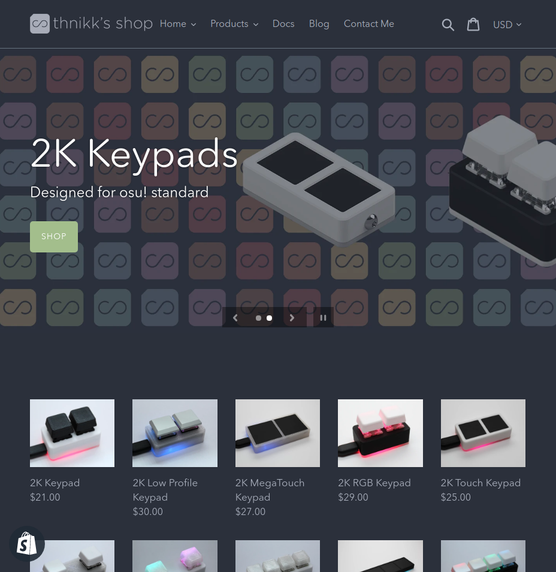
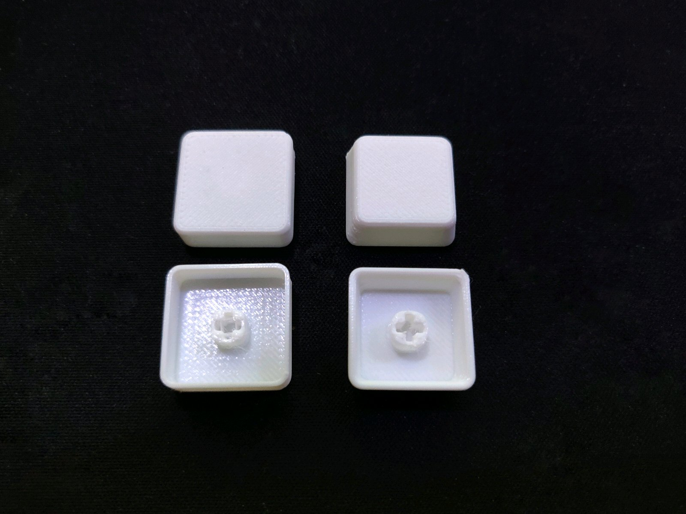
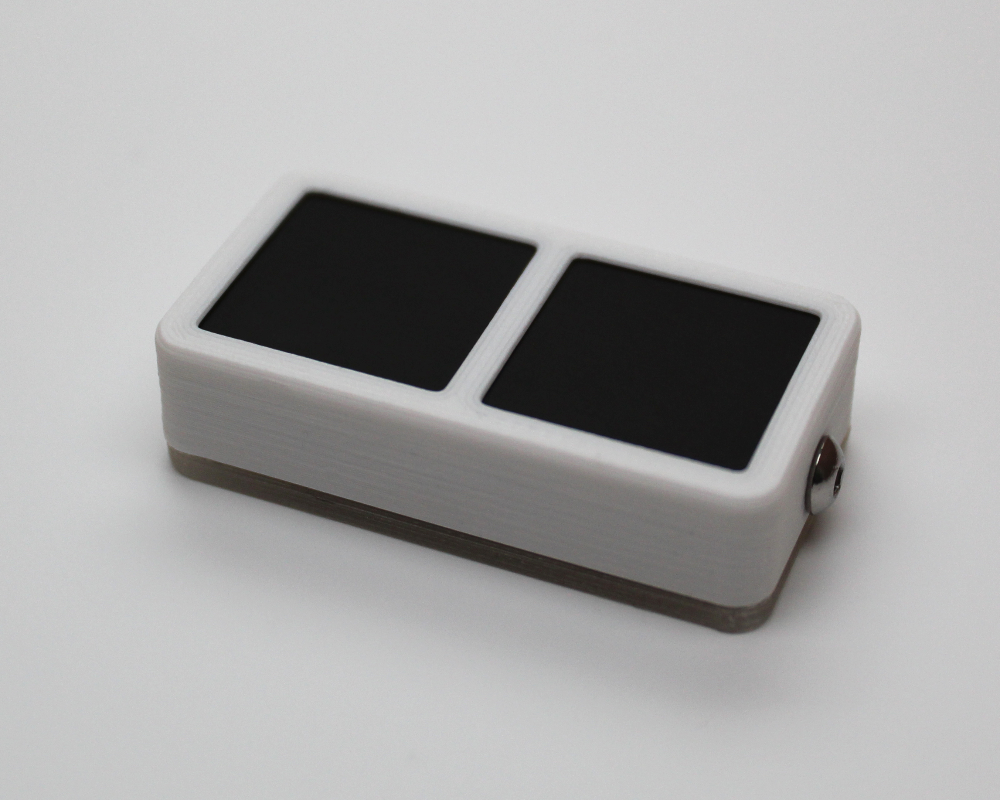

I did want to do these a lot more regularly, but somehow managed to make only three posts (including this one) in the whole year. I had a whole lot to talk about, but when it comes to writing about it, I'd usually rather spend more time working than writing about it. I have yet to make a post about my Shopify or even the updated models that have been up since September, so I'll talk about everything a little bit, but I'm going to try keeping this as brief as possible as I have about 60 more keypads to make within the next 3 or so days between family visits.

<!--more-->

## Shopify

Great timing, check it out! The shop is currently down but it's here: [Shopify](http://shop.thnikk.moe)

Since you can't see anything right now, here's a screenshot:

I've been using Shopify concurrently with Etsy for the past few months and here's what I can say about it.

### Pros

- It looks great.
- There's a lot more room for listing customization and I'm happy to keep using the service just as a way of being able to embed videos in the description and similar things, even if I'm not using them yet. I definitely have a lot more to do before I'm happy with the state of the shop, but I'm glad I have it up for now. I'm really excited about this for the DOA controller.
- You can have more than two variations per listing.
- Images aren't as terribly compressed as they are on Etsy.
- It's not Pattern, which is Etsy's terrible attempt at something similar to Shopify.

### Cons

- EVERYTHING IS SO DAMN SLOW. The management interface is somehow worse than Etsy's, which is already pretty bad (at least compared to what it was a few years ago.) Clicking on anything loads a bunch of unnecessary javascript and takes way too long to load to the point of it being a chore.
- Sometimes I highlight multiple orders to print shipping labels and the page just doesn't load.
- There's no way to view info for all orders at once, which is really annoying. On Etsy's orders page I can see what everyone ordered at a glance, and on Shopify you need to click on the order before you can see what they ordered which can take 5-10 seconds.
- You can only have a max of 100 permutations per listing, which is almost as limiting as two variations. I currently don't have the logo keycaps listed as an option for any keypad because that would exceed the limit.
- Paypal payments go directly through Paypal instead of being processed by Shopify, which is just a little annoying. Etsy pools everything together which I know a lot of people don't like, but I'd rathr get everything together.
- Discoverability is non-existent.

Shopify is great as a product portfolio, but it's not great in terms of usability. I know there are a lot of extensions you can use and some of those may help with better order overviews, but that should really be baked in and it wouldn't fix the speed issue. I haven't had as much time to play with it as I'd like, but I would like to continue adding new products and actually be able to have a readable description with a demonstration video.

## Etsy

While we're at it, let's talk about some of the annoying stuff Etsy has done lately.

- They won't leave the design alone and it gets slower every time because they hired some moron web design graduate.
- You can no longer leave public responses to reviews. Doing so used to lock the review score, but if someone leave me a 4/5 review saying "keypad slides around," I'd rather lose that 1 star forever and say "take the protective plastic off the bottom" in a response than continue to get 4 star reviews over a non-issue.
- They changed direct messages to look like instant messages, which not only makes people think they'll get an instant reply, but also that they should type one sentence fragment at a time. I previously got an email for every message and I had to turn this off the day they added this feature because I instantly got a dozen emails from one person. This isn't a criticism against anyone who messages me, I just don't understand the (forced) change. It'd be one thing if you could opt-in, but I absolutely don't want to commit to answering messages immediately all day because I have other things to do and the system I had in place was working perfectly fine for me.
- They now promote listings with free shipping over ones without free shipping (within the US.) The thing about shipping is that it isn't free. I understand what they're trying to do, but here are my options:
    - [x] Remain transparent and have shipping as an add-on that's calculated based on weight and location, which is how the cost of shipping is actually calculated.
    - [ ] Offer free shipping and increase the price by an average of the shipping cost, which varies based on location, making people within the US subsidize people's shipping outside of the US.
    - [ ] Offer free shipping within the US and don't increase the price, hemorrhaging money.
    - [ ] Offer free shipping within the US and increase the price of all of my listings within the US to integrate it into the base price... wait, this isn't possible. It's also basically what I'm already doing.

It would honestly be great if Etsy would just be what it was when I started, but that's not gonna happen. The best I can do is offer another channel for my shop which is the point of Shopify for me at the moment.

## Updated Models

The newer models are a bit smaller, have better and more simple internal geometry, and are a little more plastic-optimized. I made the hot-swap models at the beginning of the year (which honestly feels like a really long time ago,) so after printing a bunch of them over the course of over 6 months, I knew what needed to be changed to make things easier. The bottoms are now significantly stronger and the tops waste a little less plastic. The new design also helps a lot to reduce bowing in the bottom for wider keypads.

The keycaps were also updated. I honestly think the old flat keycaps were fine, but these newer ones are a little bit stronger and should result in fewer accidental presses from fat-fingering with their taper. If I was to change anything again, I'd probably make the top half taper and the bottom half straight, which might be something I'll experiment with when I get back, but having to retake pictures for every model is a huge pain in the ass so I won't be changing them again any time soon.

The touch models now have their touch pads integrated into the print itself. I print the pockets for the pads, pause the print, insert them, and the print resumes and locks them in place. This is much better than the old method of placing them in from the top and gluing them in place, and it also looks much cleaner around the edges of the pads. I feel like they are all really solid now.

That's all there really is to say. Functionally everything is identical to before, I just did some optimizations to help with print times and consistency.

## Vacation 2019

The main thing I wanted to talk about was my vacation. I'll be on vacation in Japan from the 26th to around the middle of January. The shop will continue to be up with pre-made keypads like last year, but since I'll be gone for a bit longer this year, I might run out of stock before I get back, in which case I may just put the shop in vacation mode depending on when/if it happens. I'll do my best to respond to messages but there will be no customization options beyond what I've made ahead of time. Shipping should be relatively fast since everything's pre-made, but I'm having someone help me with this while I'm gone so I'll probably only have stuff shipped out every 2-3 days, depending on the volume of orders.

## Goals for 2020

The big goal, which might always be my main goal, is to make more models that aren't just more variations of keypads for osu. I obviously want to continue with everything I'm making now, but I'd like to branch out as much as possible and make controllers for games I play.

A good example of this is the Dead or Alive controller I talked about in the last post. I did say I was aiming to have it out by the end of October, but after playing with it for a bit, I wanted some more time to play around with it. I'm going to try to play the arcade version of DOA6 while I'm on vacation and see if there's anything I could change to make it nicer to use. There is also a lot more work to do with the code if I want to add any additional LED effects.

I honestly don't play a lot of other games to make a controller for. The majority of the rhythm games I play now are mobile games. I actually really enjoyed the Groove Coaster release on the Switch, but I don't think I could make a small version of the arcade controller. The new Project Diva game is coming out soon, so that may be worth revisiting as well. There are some REALLY cheap controllers for the switch so padhacking is a much more viable option than for something like the PS4. I'll see if I can get a head start on this before the game comes out.

One last goal is to completely rewrite the code for my keypads. I've already started on this and the main goal is to combine the touch and mechanical code and try out some alternative libraries for things like LED control.

## Thank You

Thanks to everyone for supporting me again this year. Whether you bought a keypad, gave me tips, or even just read this to the end, thank you for the support. I'm excited to see what 2020 brings and I hope you have a great whatever-you-celebrate (I'm not gonna list them all.)

That's all for now and hopefully I'll come back with another post after I get back.
