I know I'm a month and a half late, but Happy New Year! I had some time off and I feel refreshed and ready to get stuff done. I've already made a ton of progress and I'm excited to be able to talk about it as the release is finally approaching.

## Fightboard/DOA Controller
I've made a lot of changes to the Fightboard (name pending) since I left. Originally I just planned on making it a simple controller for Dead or Alive and calling it a day, but the more I work on it the more I think it's a waste to not put more effort to support other games and allow for easier* remapping. I've updated the design a little bit and added a lot of features that I hope will make this a more universal controller that you can enjoy for whatever fighting game you play. I'm finally nearing the finish line on development. The physical design is complete and I'm nearing completion on the code, so I do plan on finishing it within the next week or two.
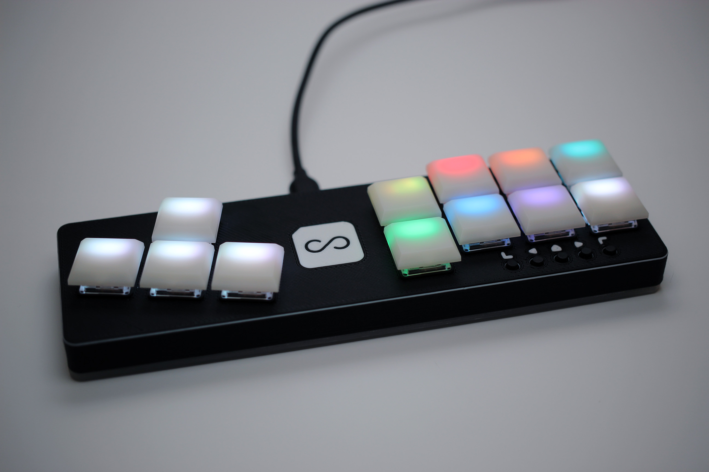

<!--more-->

### Design
The controller is now about 50% thicker than the original design. This makes wiring a lot easier, allows space for horizontal screws which are now on the back of the keypad (these aren't touch sensitive like they are on my regular keypads,) and lets me flip the PCB upside down so the top of the USB port can sit against the bottom of the case for extra support.
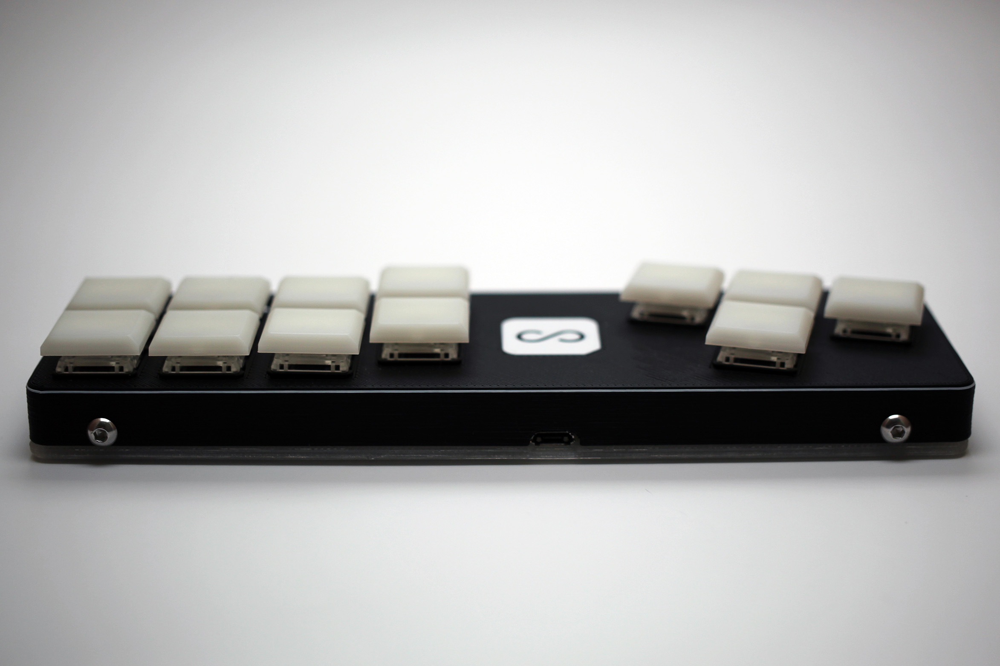

I've also added my logo and some symbols for the bottom right buttons. I've honestly been really bored making the same design over and over again, and I think this still follows the same design principles as my other keypads but adds some extra flair. To be clear, I'm not planning on adding this to any of my keypads for osu. I decided to do it for this model since it's big and already takes a long time to print anyway, and it will also be a lot more expensive than everything else on the shop (with the exception of the Future Tone controller which I no longer sell.)
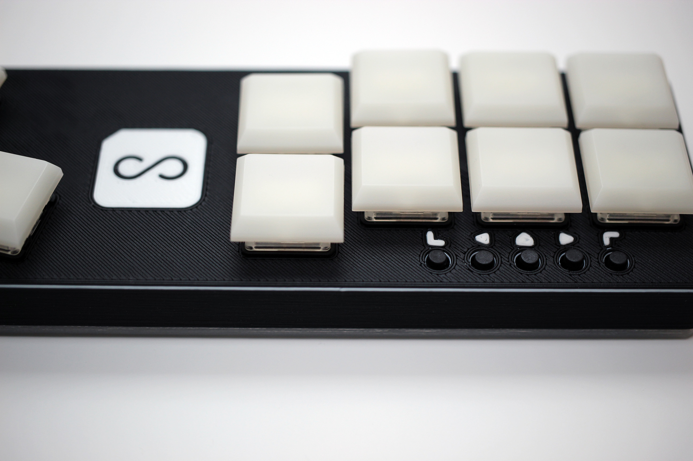

Lastly, I think I'm only going to sell it in this black and white configuration. These parts take a long time to print so I'd like to have a few already printed (maybe even completed) before I sell them to make it easier on myself. The switches will still be configurable, but I may also limit the keycaps to the unpainted ones pictured as well as I think they look the best by far and will also hold up the better to abuse than the painted ones.

### New Features
I've really changed the overall idea of this controller since its initial inception. Originally, I just wanted something to play DOA with, which still holds true now. I even said a few months ago that there's no reason not to support other games. As I started adding features in the code, I realized that I should really spend as much time as I can making this the best controller it can be and supporting as many games as I can.

#### Profiles
There's now a profile feature similar to what I have on my macropad. By holding the home/guide button and pressing one of the right 8 keys, you can switch between 8 profiles. I'm still working on it but I plan on having a standard button layout for as many games as I can. The games I plan on supporting at the moment are Dead or Alive, Street Fighter, King of Fighters, Dragon Ball FighterZ, Tekken, and... a few others (tell me if I missed something you want.) This is just for the button layout and you can still remap the buttons in-game if you'd prefer. The main advantage of the profiles is that the colors for each button change to reflect the colors used in-game as closely as possible.

#### Remapping
I also plan on having a way to override these profiles with your own customizations. After holding the guide button, you can press start and enter remap mode. You can then press a key and it'll start blinking. Press another key and it'll swap with the one that was blinking. Press start again and you exit the remapper. I think this is the simplest and most intuitive way to handle remapping the buttons on the fly, and any changes will be saved to the keypad. I'd also like to make it so if you press select while in the remapper, it'll reset that profile to default.

### Console support
I said I wouldn't do it and I still feel the same way. However, something interesting happened. I have a hacked Nintendo Switch and I use a special piece of software called sys-con (no not siscon) that allows you to use non-nintendo controllers over USB. I tried plugging my controller in and lo and behold, it was actually recognized. This gave me the idea to try a 360 to PS4 USB adapter on my PS4 and to my surprise, it also worked flawlessly. I have yet to test it with an adapter for XBox One since I don't have one, but I'll be sending a controller to a friend who has one.
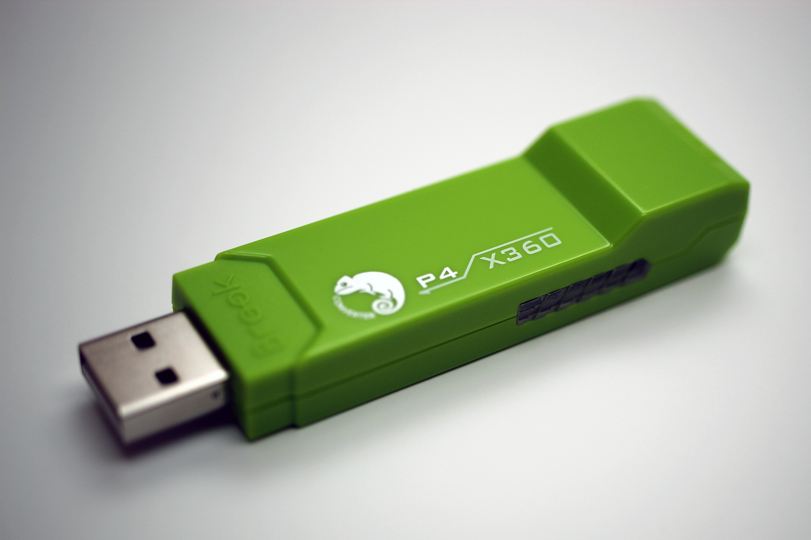
[Brook Super Converter](https://www.amazon.com/Brook-Super-Converter-Xbox-360-one/dp/B018T3WKNY)

To put it in perspective, adding PS4 support to the inside of the keyboard means I need another PCB that's able to communicate with the PS4, which involves spending about $40 USD on either an official PS4 controller and padhacking it, which takes a lot of time, or a third party board made for this sort of thing, which takes less time but still a lot. Either way, any inputs I'd want to be remappable would need 8 pins on the microcontroller for the button inputs and then another 8 pins to go out to the PS4 board. I can tell you from making the Future Tone controller that the wiring was a massive undertaking  and not fun at all.

Instead, you just put this adapter inline with the USB cable. The controller still works easily on PC without any extra configuration needed, people who only play on PC don't need to spend an extra $40 + labor cost on something they don't need, and the adapter works for other controllers. There's really no way this could have worked out better and it's a massive relief to not have to worry about how much I'm limiting my market by making it PC only.

## Japan Vacation
I don't want to talk about it too much, but I did have a great time on vacation. It's always nice to take some time off and helps me come back feeling fresh. As I briefly mentioned in my last blog post, I spent about a month in Japan from right after Christmas to the 23rd of January. It was hard to be away for that long, but I did a lot of work before I left to pre-make a bunch of keypads so the shop could keep running while I was gone.

### Comiket
I went to comiket for all 4 days. I always expect to feel overwhelmed by the amount of people, but I think there's so much excitement in the air that overtakes it. This was my first time going when they required wristbands for attendance (otherwise you have to go in a different line and buy one first,) but I got them from a Catalog I picked up on Amazon JP before I left and it wasn't a problem. Despite usually hating events with a lot of people, I always find comiket to be a really fun experience, even with it being so hectic. Here's a picture of the line (I think on day 3.)
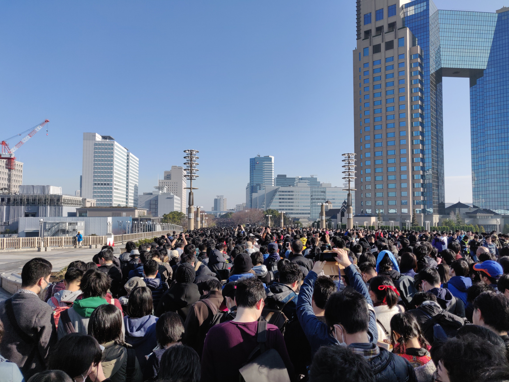

Here's a picture approaching Big Sight with everyone holding their wristbands up.
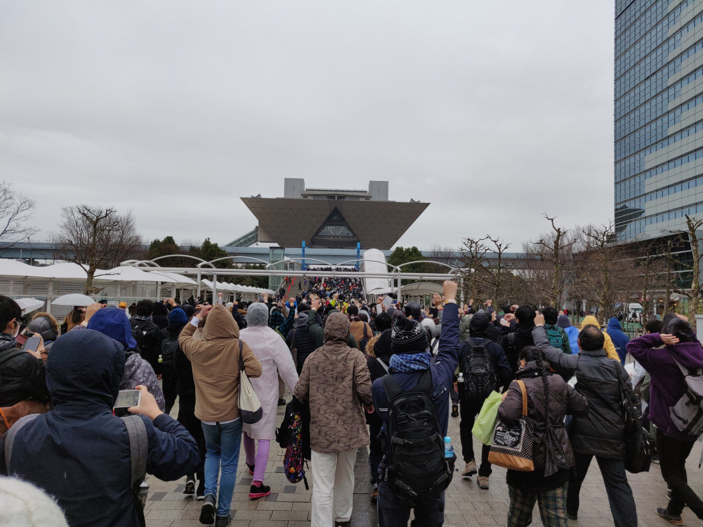

And here's a picture of a spot inside where there was enough space to take a picture.
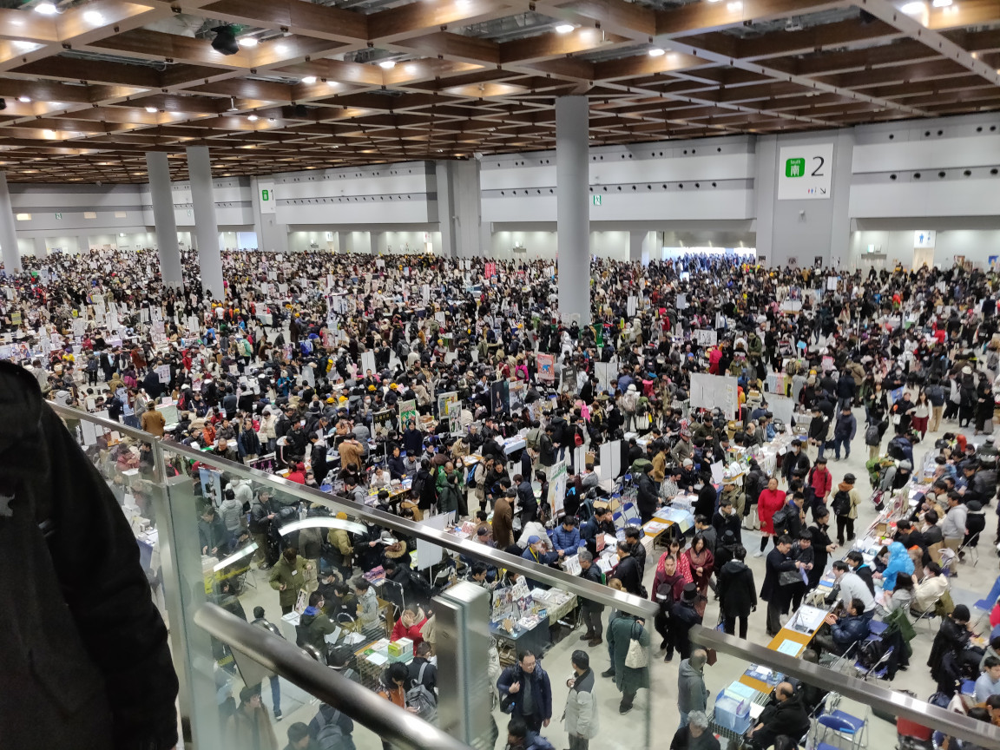

### Akihabara
I spent the rest of my time going to Akihabara almost every day. I was looking for a lot of stuff that I missed at comiket, going to some small events, doing a High School Fleet stamp campaign that I never got more than a post card from, and just looking around. It's disappointing coming home when such a cool place was only $2 and 2 train stops away. Apparently I didn't take any good pictures so here's one I took in the street, which I think they close for cars during the day on Sundays.
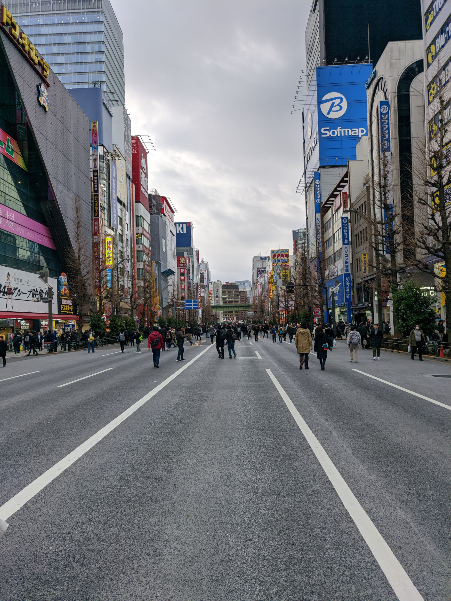

Here are the post cards as well as others I got and more can badges than I could ever use.
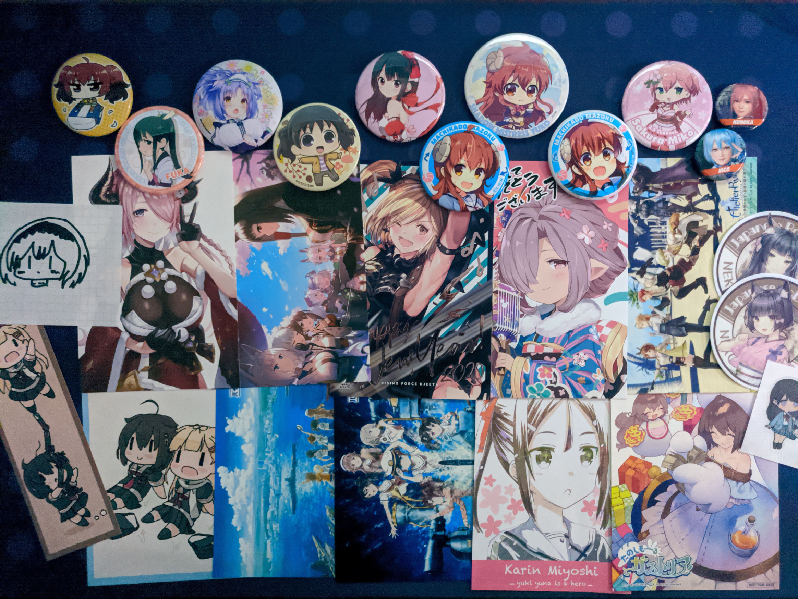

### Arcade
I enjoyed spending time in arcades more this year than the previous two times I've gone, mostly because I'm a lot more serious about DOA than I was before and I had a lot more time. I was able to play on a cabinet and had the opportunity to play against some people locally a few times which was a lot of fun, but also made me realize just how much I prefer my controller to a typical fightstick. Every cabinet in Japan uses a square gate, so DOA was especially frustrating to play as I was constantly doing the wrong holds, break holds weren't working, and the wrong moves were coming out constantly. They also swapped P+K with S from my layout which doesn't even make sense. I did get used to it a little bit, but as soon as I got home I immediately felt a lot better using my controller. They did have a USB port on the cabinet that I believe was for a controller, but I didn't have the opportunity to try it out. I did play other games like King of Fighters and P4A where the controls didn't bother me quite as much, but I think that's just because I have a lot more experience with DOA.

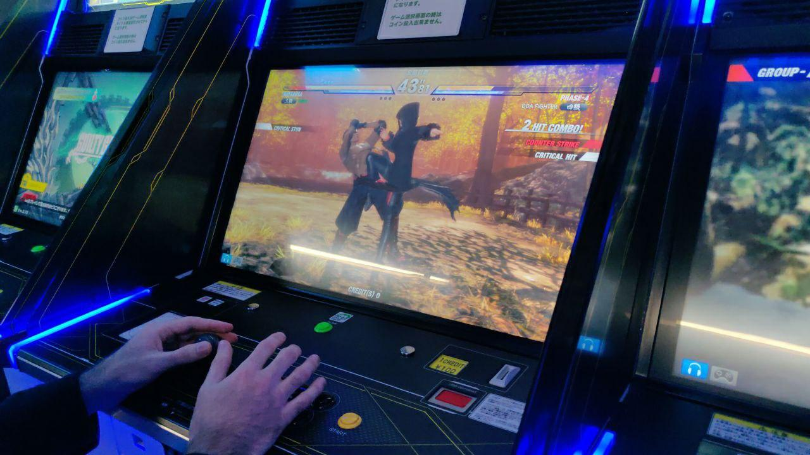

I spent most of my arcade time at Taito's Hirose Entertainment Yard (HEY for short.) They have a large selection of older games but it was also the only arcade in Akihabara that I found that had a Groove Coaster machine. It has a much more relaxed atmosphere and a large selection of fighting games. There's also a Melonbooks downstairs. The other Taito arcade had annoying stairs to get back to the first floor and the Sega arcades (all 5 of them) all feel more like UFO Catcher centers than places to play games, but it really depends on what you're looking to play. I still did try one crane game machine in HEY and got all of Chimame-tai for only about 1300 yen (about $13.)

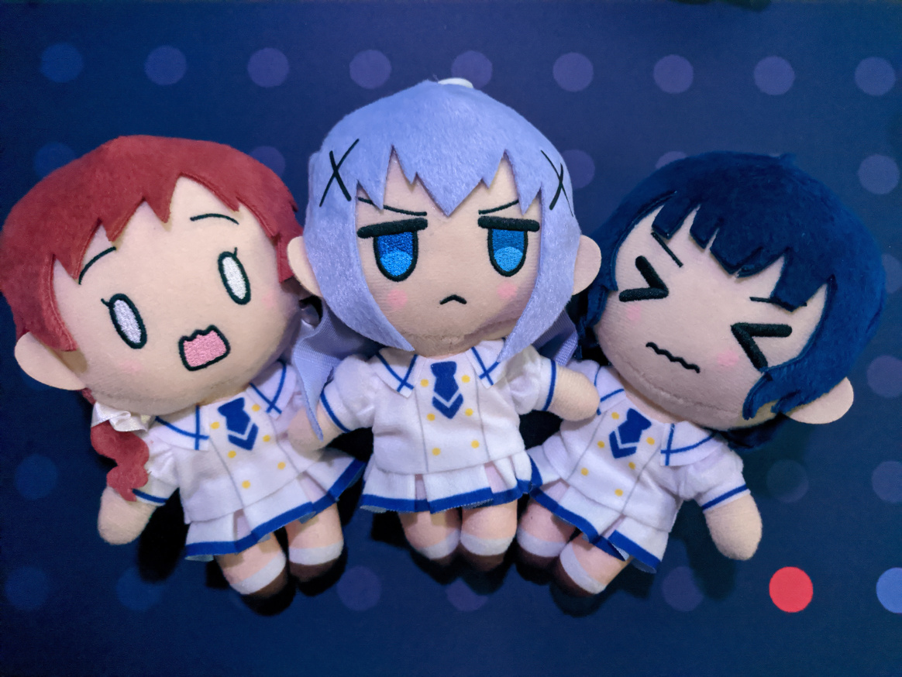

## What next
As I said before, I do plan on finishing the Fightboard by the end of the month. As far as what's next for the shop after its release, I am considering revisiting the Project Diva controller using a similar design and adapter, since the new one just came out on the Switch and it has the potential to be compatible with both the PS4 and Switch. I'd like to see how the same type of configuration feels for Project Diva and experiment with some other designs. I really love these low-profile switches because they allow for much slimmer designs, so I'm excited to work with them more. On the same topic, I'm not sure if I'll offer a Fightboard with MX switches. I can if there's enough demand for it, but I really like the reduced height and keycaps and I hope I'll be able to convey how great they are.
