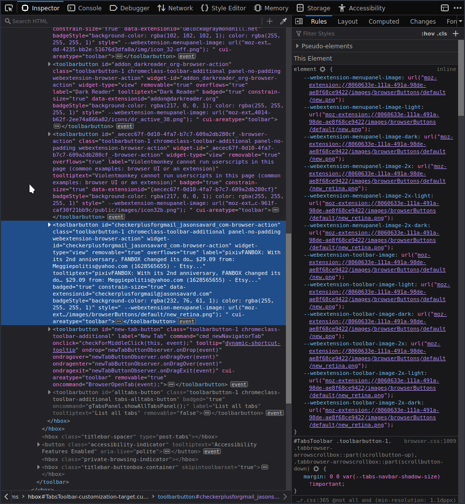
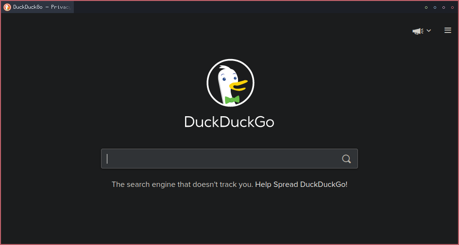

Sorry guys, no info on any new keypads or anything like that this time. I've been swamped with orders lately so a lot of development has had to go on the backburner while I fullfil orders. For now, here's a post about my recent experience with Firefox. I actually have two other posts that are 95% done so I'll try to finish those up too.

I've been unhappy with Chormium (the open-source but still very much a google product) for a while now, and started looking for a good alternative over the past month. I've tried schizophrenic Vivaldi, un-Googled Chromium which takes hours to compile, anemic extensionless qutebrowser, privacy focused yet lackluster Brave, and none of them really did it for me. The two things I'm looking for are more customization (or just an interface that wastes less space) and something more privacy focused, which leaves one choice.

<!--more-->

## Firefox
I used Firefox for a large part of my childhood and was happy with it over using something like IE. At the time, it was the only browser that supported extensions, making things like ad blockers possible without any extra setup. Then Chrome came out and it did all of the same stuff but was way faster, and I've been using it ever since. I've tried to go back to Firefox about once a year to give it another chance, but it's always been slower and had one or two deal-breakers. For example, if you tried to playback an html5 video at 2x speed yast year on Linux, speech became completely intelligible and sounded like it was skipping syllables. The year before that, maybe it was something like a webpage I used regularly wouldn't render properly (I think it was pixiv.) Despite having these problems, development is always going strong and things are getting fixed. We're now at the point where there's very little speed difference and most of the problems have been fixed. I won't say all to avoid cursing myself, but I have yet to run into any more deal-breakers over the past week of using it. The only issue I had this time was that fullscreen video was stuck at ~5 fps, but I think that is particular to my hardware and was easily fixed by forcing GPU acceleration of the browser itself.

### What makes it so great?
There are several reasons I settled on Firefox instead of any of the other options.
- I don't trust Google, but I REALLY don't trust Opera and Vivaldi.
- I actually use ublock to block non-ad page elements all the time, so having a subpar adblocker built-in to a browser like Brave doesn't interest me at all. I'd also rather not have the crypto miner.
- It's one of the only major browsers that isn't chromium based. I don't particularly have an issue with chromium-based browsers, but having more diverse software options is a good thing and deserve whatever support they can get.
- You can customize the UI to your heart's content.
- Every setting is either synced to your (optional) Firefox account or saved to a file you can easily transfer between installs.
- Passwords are synced to your acocunt and it has an equivalent password generator to Google's.
- It has a robust library of extensions without piggybacking on the chrome web store.

### UserChrome
UI customization of Firefox is done through a simple css file. How could you make it simpler, you ask? How about using the same inspector for website on the browser UI itself.

This is one of the coolest features of any browser. You can easily find element names and classes by clicking on them, preview any changes you'd like in real time, and then put them in your css file to make them permanent. It turns "our browser supports customization" into "please customize our browser."

### User.js
All browser configuration can be done by going to about:config and settings are saved to a file called prefs.js in your profile directory. However, if you are setting up a bunch of machines that you want the same settings on, you can use a user.js file which has priority over prefs.js with any setting contained within. This means you can set up your whole configuration, copy the relevant settings from prefs.js to user.js, and then use that user.js file between machines without having to manually go through all of the settings through the UI. This is really powerful and a huge time saver if you have more than one computer but want the same settings across both.

The only unfortunate thing is that this may be removed in the future for security concerns. If that's the case, it wouldn't be difficult to edit prefs.js directly, but it's nice having an override file like this as it makes it more difficult to completely break anything.

## End result
I've spent the past week working on my configuration and here's what I've come up with:

The URL bar only shows when in use (can be brought up with F6 or ctrl+l.) The tab bar has been simplified with the new tab and close tab buttons removed since they can be done with the keyboard or middle mouse button. The tabs themselves are smaller and inactive tabs are less distinct from one another, since you can already see the division with the favicons and text gradient. Lastly, when extensions are placed in the tab bar, their icons are converted into a circle of a desired color. The circle becomes filled on mouse hover and clicking on the circle is the same as clicking on the extension icon, so I have quick access to things like gmail checker, violentmonkey, darkreader, and ublock, without having their big ugly icons that clash with the rest of the design. By default, any new extension in the bar will be a white circle, but a color can be assigned very easily in the css.

I definitely recommend trying out Firefox again for any long-term Chrome users, especially if you're trying to escape Google's grasp. It's really come a long way and I'm happy there's finally a viable alternative to Chromium.
