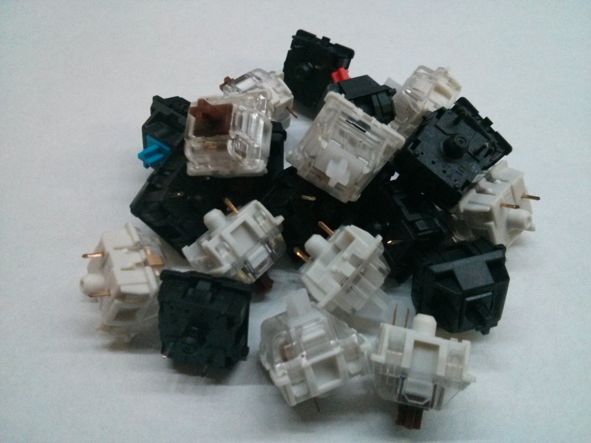
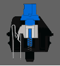
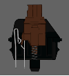
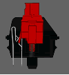
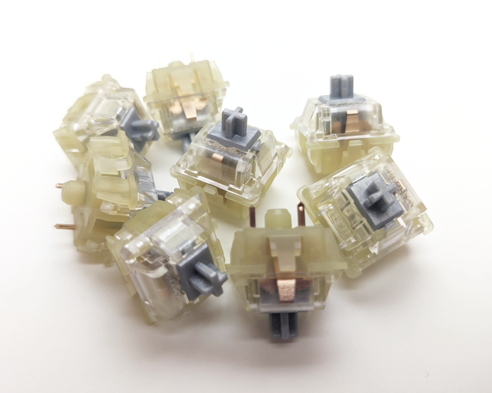
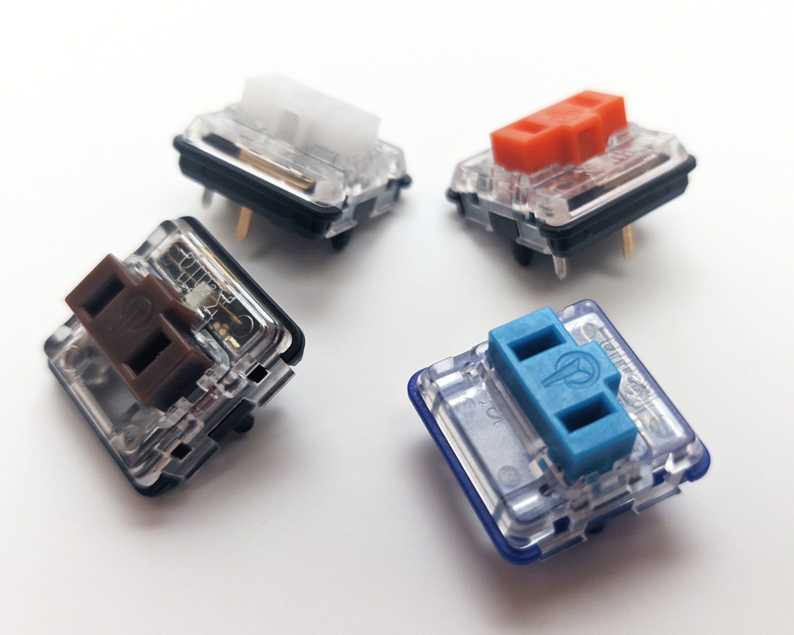
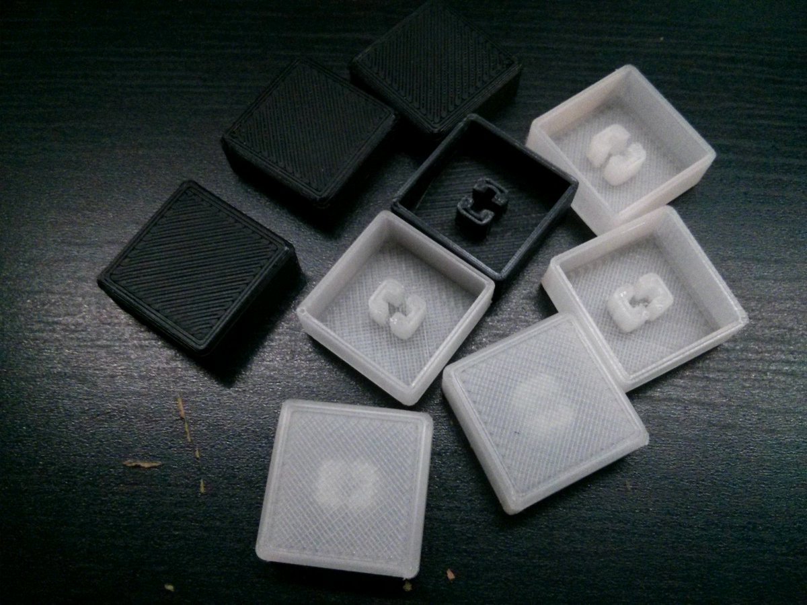

A lot of people have had a lot of questions about my keypads for determining which model and what parts would be better for them, so I'll outline the differences here.

## Switches

This may be the most important choice you can make with your keypad. Luckily, you aren't stuck with your choice thanks to the hot-swap sockets, so don't feel too stressed out. Switch choice is ultimately personal preference, so I'll do my best to provide both objective and subjective information.

### Clicky

These have both a bump and an audible click when the switch is pressed to its actuation point. This is nice for typing (especially touch typing) since it's a clear indication that you've pressed the switch. It's great for avoiding "bottoming out," meaning the switch is fully depressed, which can help reduce fatigue from typing over long periods of time.

However, this is situationally advantageous. Games are much more hectic than typing and if you try to feel or listen to the click, you will be pulling your atention away from the game. Some players may be able to take adavantage of the click, but I find it distracting. It would be a nice option for a macro keypad if you want to use it for professional applications, but be mindful if you want to use it with other people around as they are pretty noisy.

### Tactile

These offer the same benefit as clicky switches for typists, but the same downside for games. They have the same bump at the actuation point but no audible click. These would also be nice for professional applications and are better in quiet environments.

### Linear

Linear switches offer a nice variety in weight (actuation force) and don't have any audible click or tactile bump. I would consider these the best for osu! and gaming use in general.

### Actuation Force Table

| Switch Type | Actuation Force | Cherry MX | Gateron |
| --- | --- | --- | --- |
| Linear | 35g | --- | Clear |
| Linear | 45g | Red/Silver | Red/Silent Red |
| Linear | 65g | Black | Black |
| Clicky | 55g | Blue | Blue |
| Tactile | 50g | Brown | Brown |

### Cherry MX VS Gateron

One other thing to mention is the difference between Gateron and Cherry switches. Cherry is a German company that's been making these for a long time, but their patent ran out and a bunch of other companies started making MX clones. Among those companies is Gateron. They are considerably smoother feeling, where Cherry's switches have a bit of a scratchy feel to them.

### Cherry MX Silver

Though MX silvers (also referred to as MX Speed switches) have the same actuation force as MX reds, there are two key differences that set them apart. The first is their higher actuation point, at 1.2 mm instead of the 2 mm on a normal Cherry MX switch. This means the key will be detected as pressed much higher in the keystroke, but I think the same caveat exists that does with tactile/clicky switches. In a hectic gaming scenario, particularly with playing a rhythm game, it won't make a difference if you're bottoming out the keys. However, the second difference is that they bottom out at 3.4 mm instead of the typical 4 mm, which means it should have an impact (no matter how minuscule) whether you bottom out the keys or not.

### Kailh Choc

Kailh's low profile Choc switches offer some unique advantages over standard MX-style switches.

- They are better designed for hot-swapping, since the legs of the switch are longer than the lower half of the switch. This means you can actually see the pins going into the socket and make sure it's going in straight.
- A higher actuation point like MX Silvers, but a bit further into the travel at 1.5 mm compared to 1.3 on Silvers.
- 3 mm of total travel compared to 4 on MX switches.
- Shorter keycaps for improved ergonomics.

| Switch type | Actuation force | Color |
| --- | --- | --- |
| Linear | 20g | gchoc (blue)/pink |
| Linear | 50g | Red |
| Tactile | 60g | Brown |
| Clicky | 60g | White |

### Touch Keypad

This isn't a keyswitch, but I think it's worth including here just as a reminder that it's an option. There are a few advantages to the touch keypad:

- It's actually silent. You're not pressing anything that moves, so it should be very similar to tapping directly on your desk but with a little extra padding thanks to the micro-suction tape on the bottom of the keypad.
- It's small. The regular touch models are small enough to not even notice in a bag and the MegaTouch models are a bit bigger, but still thin enough to fit in a small backpack pocket without being bulgy.
- The travel distance is effectively zero. If you normally hover over your mechanical keys, this is worth considering since not only do you need to push down until your fingers touch the keycaps, but they have to continue to push the key down to the actuation point and maybe even to bottom out the switch, which can easily be ~5 mm. The touch models detect your fingers on contact so the only finger movement is to make contact with the pads.

There's a bit of a learning curve. If you play any mobile rhythm games and don't mind the feel, and especially if you turn off hit sounds like me, I think it's a no-brainer and the adjustment period should be very short for you.

## Keycaps

Keycaps are available in a number of different profiles, as shown in the image below:

### DCS

DCS keycaps are what you'll most commonly find on mechanical keyboards. They feature a subtle curve vertically that your finger can rest in and an angle depending on the row. They are comfortable for both typing and osu, but you have to be a bit more precise with your button presses.

### DSA

DSA keycaps are a little more rare but offer a completely flat profile across all keyboard rows. This makes it easy to get a whole bunch of blank ones since all 1x keycaps are the same, unlike the DCS keycaps that differ by row. They have an old-fashioned look to them and feature a slight concave curvature on the top of the key. They work well for osu but less for typing on a keyboard since the flatness of them makes them less ergonomic.

### Flat

Flat keycaps are the least common by far. I bought a few from pimpmykeyboard.com a year or two ago and loved them, but they were a bit too expensive so I figured nobody would want to pay $4+ for them. Fast forward to 2017 and I have a bit more experience in 3D printing. Now I can offer them not only as a cost saving measure to both you and myself, but also be happy that they work well and provide a very nice experience in osu.

These offer two major improvements over DCS and DSA keycaps. They expand the surface area of the top of the key to their maximum, giving you more leeway with where you press. They also allow me to have better control of both the travel distance and the max height of the keypad, which means that your hand won't have to rest at as high of an angle which should result in a more comfortable experience over long sessions.
