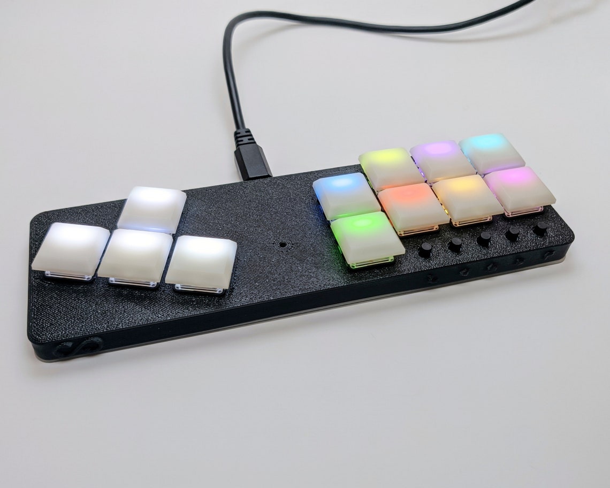
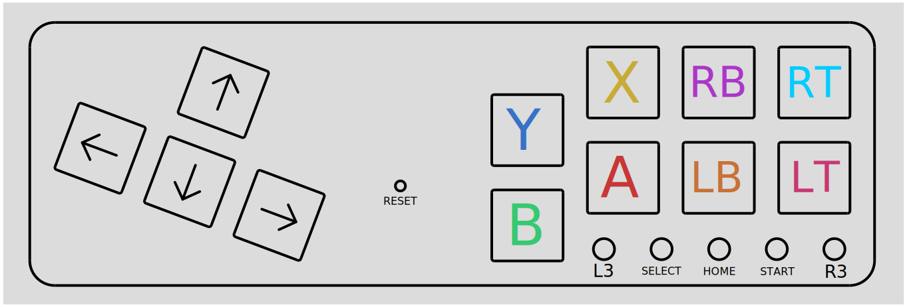
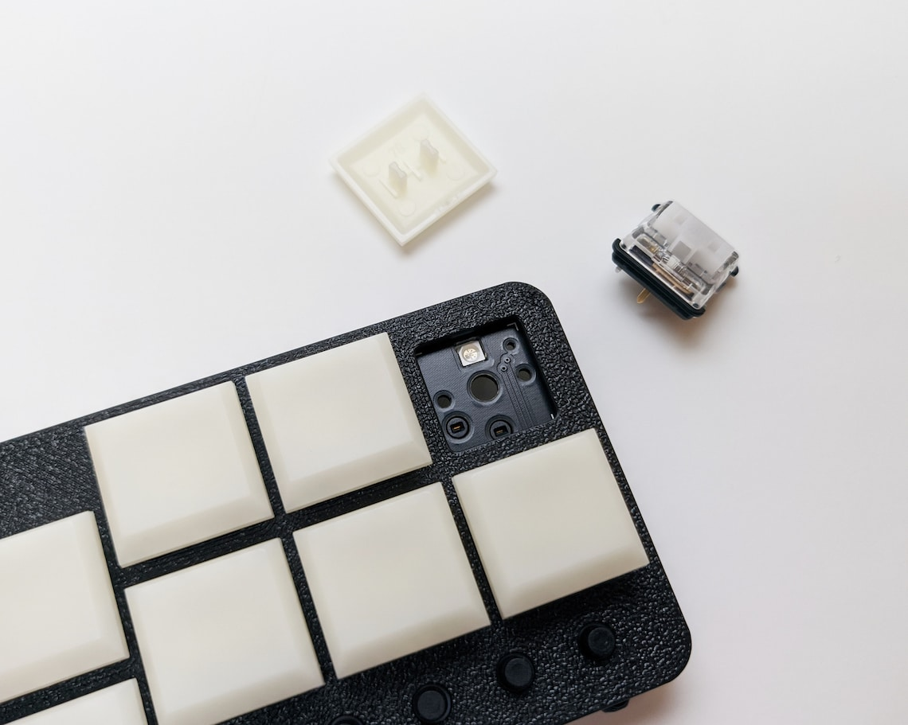

Have you ever been frustrated with fightsticks? Do you want something to use on your desk that isn't a massive box you have to put away somewhere when you're not using it? Do you prefer the natural spacing of a keyboard over the finger-stretching traditional arcade buttons? Maybe you want something that you can easily use on-the-go. The Fightboard aims to solve all of those problems.

## Features

### Ergonomic layout

The Fightboard uses a combination of an arrow/wasd cluster at a 20% angle and action buttons following the traditional arcade stick layout but with the spacing of keyboard keys.

### Hot-swap sockets

Unhappy with your switch choice? Want different zones with different types of switches? All you have to do is pull them out and swap them with whatever you prefer, no soldering required.

### RGB LEDs

The RGB LEDs indicate the function of each button. The default profile uses Xbox colors for the 4 face buttons, but these can be changed to suit your preferences or the colors used in-game. The LED for each key turns off when the key is pressed and fades back on when released.

### Idle mode

The LEDs will turn off after a minute of inactivity. Pressing any button will turn them back on.

### Easy remapping

Settings are all built into the keypad and allow you to remap keys on-the-fly.

### SOCD cleaning

Left+Right will cancel each other out and Up+Down will function as Up.

## MX vs LP

There are two different versions of the LP for two different types of switches. The Fightboard MX uses Cherry MX compatible switches which gives it the advantage of broader compatibility since there are more MX switches and keycaps on the market. The Fightboard LP uses Kailh Choc switches, which allows it to be lower profile for improved ergonomics. There is still a selection available for Kailh Choc switches, so you can choose between clicky, tactile, and linear, but Kailh is the only company making these switches.

The sockets and switch depth of the two switch types are completely different, which is why there are two separate models.

## Firmware

All Fightboards ship with the latest firmware at the time of shipping. Refer to the readme in the zip for installation instructions.

| Version | Notes | Date |
| ------- | ----- | ---- |
| [1.0](https://thnikk.moe/files/FBUpdater.zip) | | |
| [1.1](https://thnikk.moe/files/FBUpdater_1.1.zip) | | |
| [1.2](https://thnikk.moe/files/FBUpdater_1.2.zip) | | |
| [1.3](https://thnikk.moe/files/FBUpdater_1.3.zip) | | |
| [1.4](https://thnikk.moe/files/FBUpdater_1.4.zip) | Support for v2 Fightboard added | 7-6-21 |
| [2.0](https://thnikk.moe/files/FBUpdater-2.0.0.zip) | Added Nintendo Switch input mode | 1-26-22 |
| [2.0.1](https://thnikk.moe/files/FBUpdater-2.0.1.zip) | Fixed analog stick not being in neutral position when not in use. | 4-20-22 |
| [2.0.2](https://thnikk.moe/files/FBUpdater-2.0.2.zip) | Fixed color change not working on key 1 | 6-27-22 |

### Troubleshooting

If you're having any issues with updating the firmware, try following the [troubleshooting guide](/fb-troubleshoot/).

You can also check out FeralAI's alternative firmware for the [v1](https://github.com/FeralAI/FightboardHybrid/releases/tag/v0.1-alpha) or [v2](https://github.com/thnikk/FightboardHybrid/releases/tag/v0.1.1-alpha), but this firmware has been deprecated as of version 2.0.

## Compatibility

The Fightboard is only compatible with PC and the Nintendo Switch out of the box, but can be made compatible with other consoles with the adapters listed below. If using one of these adapters, the Fightboard needs to be in XInput mode.

| System | Compatible | Link |
| --- | --- | --- |
| PC | Yes | No adapter needed |
| Switch | Yes | No adapter needed |
| Xbox One | Yes | [Brook Wingman XBOne](https://www.amazon.com/Brook-Wingman-Support-Controller-Converter/dp/B08H1SYGWV) |
| PS4 | Yes | [Brook Wingman PS4](https://www.amazon.com/Brook-Wingman-Support-Controller-Converter/dp/B08B82M9TG) |
| PS5 | Partial | Only compatible with PS4 games using the PS4 adapter linked above. |
| Xbox 360 | No | Not compatible |

## Input mode

To change input modes on the Fightboard, hold down L3 for Switch or R3 for XInput while plugging the Fightboard in. The LEDs will turn red or green to indicate which mode you're using respectively. This setting is stored so you don't need to do it every time, only when you want to switch modes.

## Configuration

All other settings are accessible from the controller itself by pressing left+right(d-pad)+home to enter the configuration menu.

### Brightness control

You can increase or decrease the brightness of the LEDs by holding up or down from the main menu.

### Direction mode

As of firmware version 1.2, you can change the directional keys to function as either a dpad or the left analog stick, since some games require one or the other. After entering the menu, you can press L3 to enable dpad mode (the keys will turn red) and R3 to enable left stick mode (the keys will turn yellow.)

### Profiles

From the main menu, you can press one of the 8 keys on the right to switch between 8 different profiles. These all have independent settings so you can set up each profile for a different game, each with different colors and mappings.

### Button swapping

You can press the start button after entering the menu to enter the button swapper. In this mode, pressing one of the 8 buttons on the right will make it pulse quickly. Press another button and the two buttons will swap places, along with their colors.

<video width="100%" controls>
    <source src="videos/remap.mp4" type="video/mp4">
    Your browser does not support the video tag.
</video>

### Color changing

You can also press back on the main menu to enter color changing mode. Pressing one of the keys will cycle through RGB for that key.

<video width="100%" controls>
    <source src="videos/color.mp4" type="video/mp4">
    Your browser does not support the video tag.
</video>


Remapping and color changing are only available for the 8 keys on the right. The d-pad keys are not reconfigurable.


### Resetting

Pressing L3 and R3 simultaneously in the main menu will clear the current profile back to its default settings.

<video width="100%" controls>
    <source src="videos/reset.mp4" type="video/mp4">
    Your browser does not support the video tag.
</video>

### Exiting menus

Pressing the home button will always take you one step back out of a menu, meaning it will take you to the main menu on the color changer or remapper and exit from the main menu.

<video width="100%" controls>
    <source src="videos/menuClose.mp4" type="video/mp4">
    Your browser does not support the video tag.
</video>
