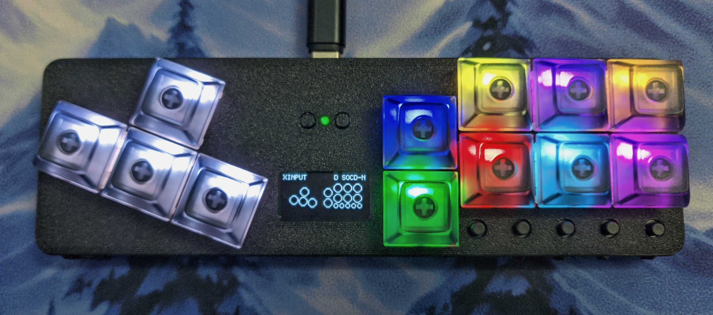

The v3.1 model is a soft upgrade over the v3. The main changes are:

- Reset and Bootsel buttons are both exposed.
- Board LED is exposed
- Major firmware upgrade (also compatible with the v3 model)

# Display Mini Menu

The mini menu allows for configruation to be done directly on the device. This can be opened with  and you can navigate with     and select/cancel with  .

# Board LED

The board LED was added to provide some feedback for basic fightboards. It indicates the current input mode and will blink when switching profiles to indicate the index of the current profile.

# Keybinds

| Keybind | Action |
| ------- | ------ |
|| Open Mini Menu |
|| Previous Profile |
|| Next Profile |

# Boot binds
Hold these keys at boot to activate special functions.

| Keybind | Action |
| ------- | ------ |
|| Change input mode to XInput |
|| Change input mode to Switch |
|| Change input mode to Switch Pro |
|| Change input mode to PS3 |
|| Change input mode to PS4 |
|| Change input mode to PS5 |
|| Change input mode to Keyboard |
|| Open Web Config |
|| Open web config with Advanced Configuration tab |
