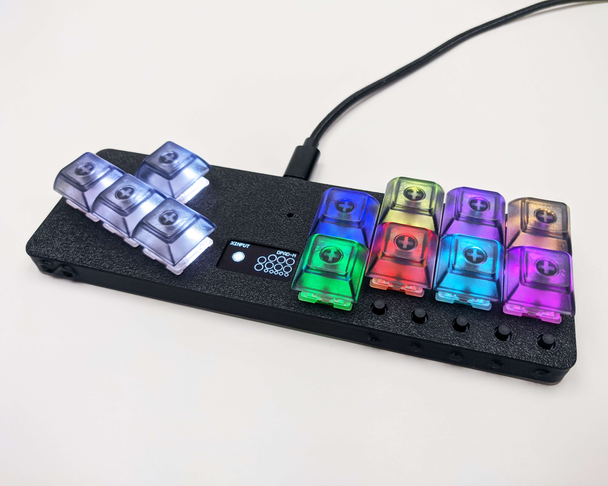
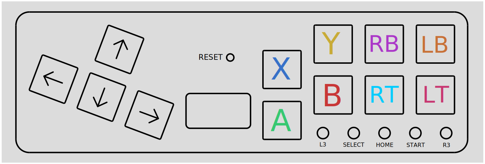
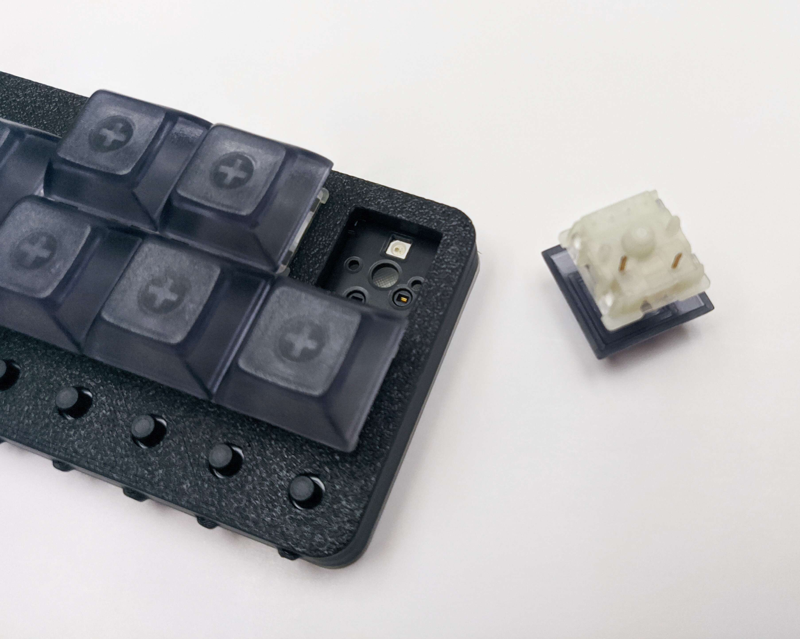
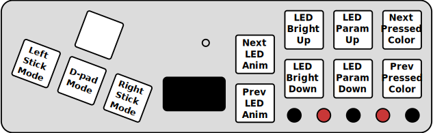
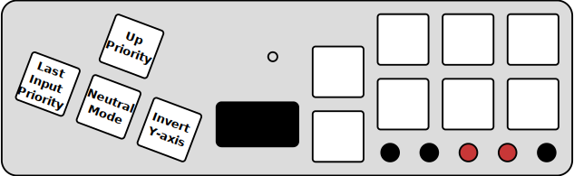
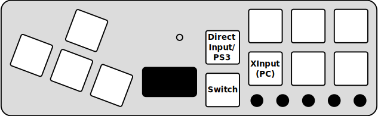

The v3 version of the Fightboard adds a display and switches to new electronics and firmware.

## Features

### Ergonomic layout

The Fightboard uses a combination of an arrow/wasd cluster at a 20% angle and action buttons following the traditional arcade stick layout but with the spacing of keyboard keys.

### Hot-swap sockets

Unhappy with your switch choice? Want different zones with different types of switches? All you have to do is pull them out and swap them with whatever you prefer, no soldering required.

### RGB LEDs

The RGB LEDs indicate the function of each button. The default profile uses Xbox colors for the 4 face buttons.

### Idle mode

The LEDs and display will turn off after a minute of inactivity. Pressing any button will turn them back on.

### SOCD cleaning

There are three available SOCD modes:

- Neutral: Pressing opposite directions results in no input
- Up priority: Left + right will cancel out and up + down will be up
- Last input: Whatever key was hit last will have priority

## MX vs LP

There are two different versions of the LP for two different types of switches. The Fightboard MX uses Cherry MX compatible switches which gives it the advantage of broader compatibility since there are more MX switches and keycaps on the market. The Fightboard LP uses Kailh Choc switches, which allows it to be lower profile for improved ergonomics. There is still a selection available for Kailh Choc switches, so you can choose between clicky, tactile, and linear, but Kailh is the only company making these switches.

The sockets and switch depth of the two switch types are completely different, which is why there are two separate models.

## Firmware

All Fightboards ship with the latest firmware at the time of shipping. No new versions of the firmware are available at the moment, but you can view the source code here:
[Github](https://github.com/thnikk/GP2040)

The latest firmware uf2 is available here: [normal](https://www.thnikk.moe/files/fbv3.uf2) [mirrored](https://www.thnikk.moe/files/fbv3-m.uf2)

### Troubleshooting

If you're having any issues with updating the firmware, try following the [troubleshooting guide](/fb-troubleshoot/).

### GP2040-CE

There's an active fork of the firmware used on the Fightboard [here](https://gp2040-ce.info/downloads). As I am not the maintainer of this project, I can't guarantee the stability of the firmware, but you are welcome to try it if you'd like newer features. To flash it, you need to:

1. Download [flash_nuke.uf2](https://gp2040-ce.info/assets/files/flash_nuke-cde388d5530c9dcfd5394a0ca51009f2.uf2) and the latest version of the [firmware](https://gp2040-ce.info/downloads).
2. Get the Fightboard into bootloader mode by double-pressing the reset button. You should see a removable storage device called "RPI-RP2" get mounted.
3. Copy the flash_nuke uf2 to RPI-RP2. The Fightboard will reboot and RPI-RP2 should automatically remount within ~10 seconds.
4. Copy the GP2040-CE uf2 to RPI-RP2. The Fightboard will reboot again and the display should show the new splash screen.

> **Warning**: You **MUST** flash flash_nuke whenever switching between the default firmware and GP2040-CE.

## Compatibility

The Fightboard is only compatible with PC and the Nintendo Switch out of the box, but can be made compatible with other consoles with the adapters listed below. If using one of these adapters, the Fightboard needs to be in XInput mode.

| System | Compatible | Link |
| --- | --- | --- |
| PC | Yes | No adapter needed |
| Switch | Yes | No adapter needed |
| Xbox One and Series X/S | Yes | [Brook Wingman XB2](https://www.amazon.com/Brook-Wingman-Converter-Controller-Adjustable/dp/B0BJ6M9JPD) |
| PS4 | Yes | [Brook Wingman PS4](https://www.amazon.com/Brook-Wingman-XE-Converter-Controller/dp/B0BV2FW229) |
| PS5 | Yes | [Brook Wingman FGC](https://www.brookaccessory.com/products/wingmanfgc/index.html) |
| Xbox 360 | No | Not compatible |

## Configuration

### Main settings

Holding down select and start will let you change the settings shown below:

### SOCD settings

Holding down home and start will let you change the SOCD settings:

### Input modes

Holding down one of the keys at boot will change the input mode. This setting is saved and will persist across reboots.

For all configuration, please refer to the official [GP2040 documentation](https://gp2040.info/#/usage).
