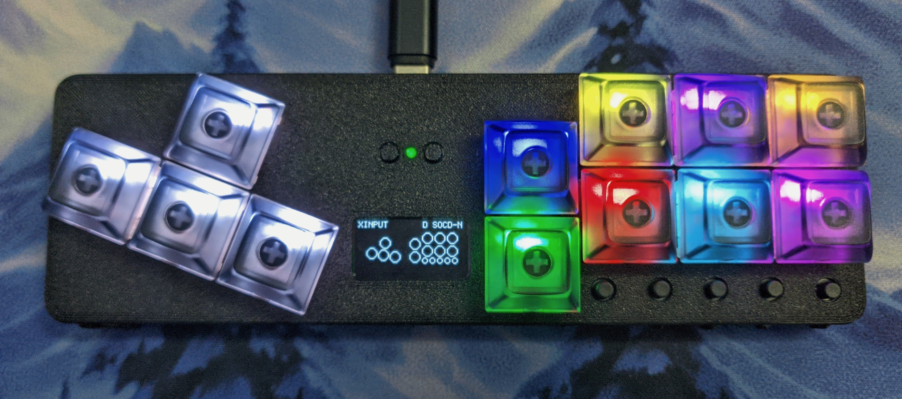

The v4 model is a soft upgrade over the v3. The main changes are:

- Reset and Bootsel buttons are both exposed.
- Board LED is exposed
- Different keybinds

There are also major firmware changes, with an updated web config and new display menu. The new firmware works with the v3 model, but the board LED isn't exposed.

# Display Mini Menu

The mini menu allows for configruation to be done directly on the device.

# Board LED

The board LED was added to provide some feedback for basic fightboards. It indicates the current input mode and will blink when switching profiles to indicate the index of the current profile.

# Keybinds

| Keybind | Action |
| ------- | ------ |
|| Open Mini Menu |
|| Previous Profile |
|| Next Profile |
