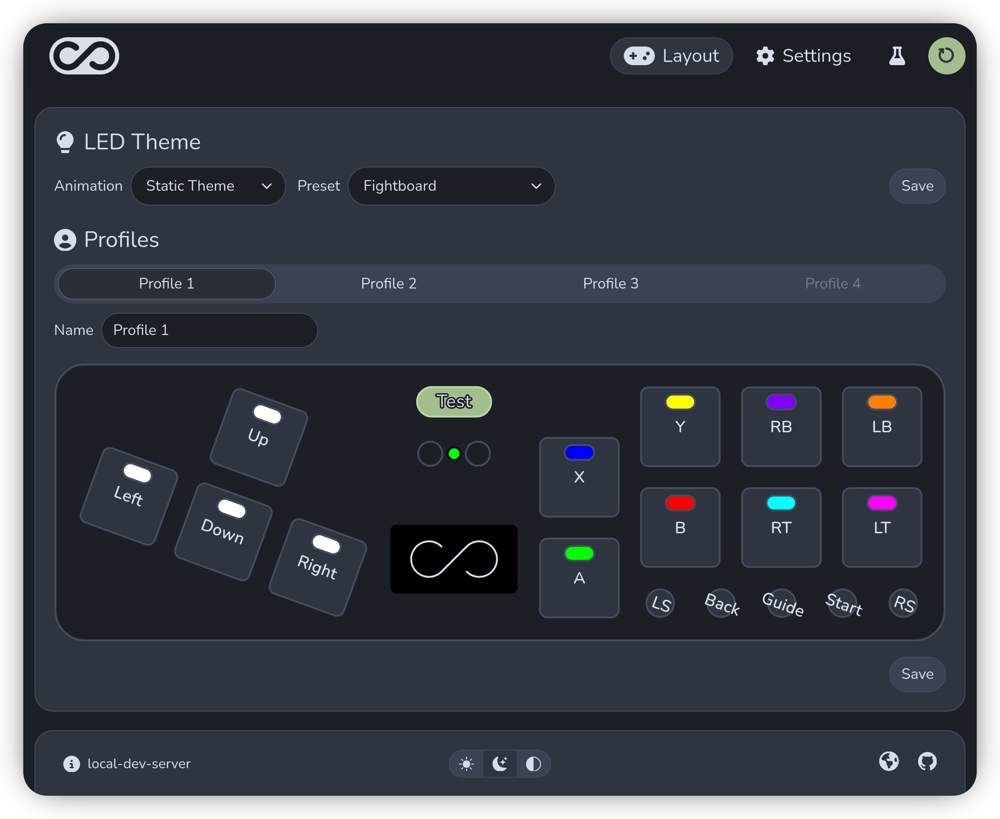
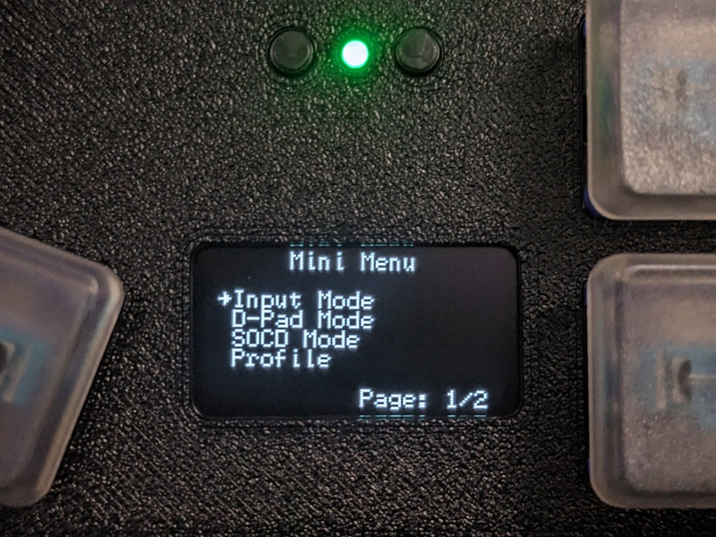

All current Fightboard and Springboard models run on the same firmware: GP2040-th, a fork of [GP2040-CE](https://github.com/OpenStickCommunity/GP2040-CE) as of v0.7.10.

The latest firmware is available on the [releases page](https://github.com/thnikk/GP2040-th/releases).

## What's new in v1.0.0

v1.0.0 is a major update that reworks a lot of the firmware. The main changes are:

- Rebuilt web config: The web config has been reworked with a focus on configuring existing boards.
- Board remapper: A graphical representation of the controller is used for easy 1:1 remapping.
- Mapping widgets: Similar to the board remapper but these are for controller buttons and keyboard keys.
- Board LED addon: The on-board LED indicates the current input mode and blinks when switching profiles.
- Per-profile keyboard mapping: Unique keyboard mapping for each profile.
- Pin-based mapping: All controller, keyboard, and LED mapping are tied directly to pins instead of actions.
- Integrated Mini Menu: The mini menu is now enabled by default and uses sensible keybinds.

## Configuration

There are two ways to configure the controller: the web config for in-depth setup from your computer, and the mini menu for quick changes directly on the device.

### Web Config

The web config is the main way to configure the controller. It runs in your browser and is best for in-depth setup, like remapping buttons, adjusting profiles, and LED themes, before you start playing.

Hold  at boot to open it and access it by going to [192.168.7.1](http://192.168.7.1/) in your web browser.

### Mini Menu

The mini menu is for making quick changes on the device without a computer. Most settings are available, but more complex settings like per-key LEDs for the custom theme require the web config.

It can be opened with  and you can navigate with     and select/cancel with  .

## Board LED

The board LED provides some basic feedback. It indicates the current input mode and will blink when switching profiles to indicate the index of the current profile. It's also used to preview color changes from the mini menu.

## Input Modes

Hold these keys at boot to change the input mode. You can also change the input mode through the web config and mini menu.

| Mode | Description | Color | Keybind |
| ---- | ----------- | ----- | ------- |
| XInput | Standard input mode for PC games |  ||
| Switch | Native mode for the Nintendo Switch |  ||
| Switch Pro | Pro Controller protocol for the Nintendo Switch |  ||
| PS3 | Native mode for the PlayStation 3 |  ||
| PS4 | PlayStation 4 protocol (PC only) |  ||
| PS5 | PlayStation 5 protocol (PC only) |  ||
| Keyboard | Emulates a keyboard |  ||
