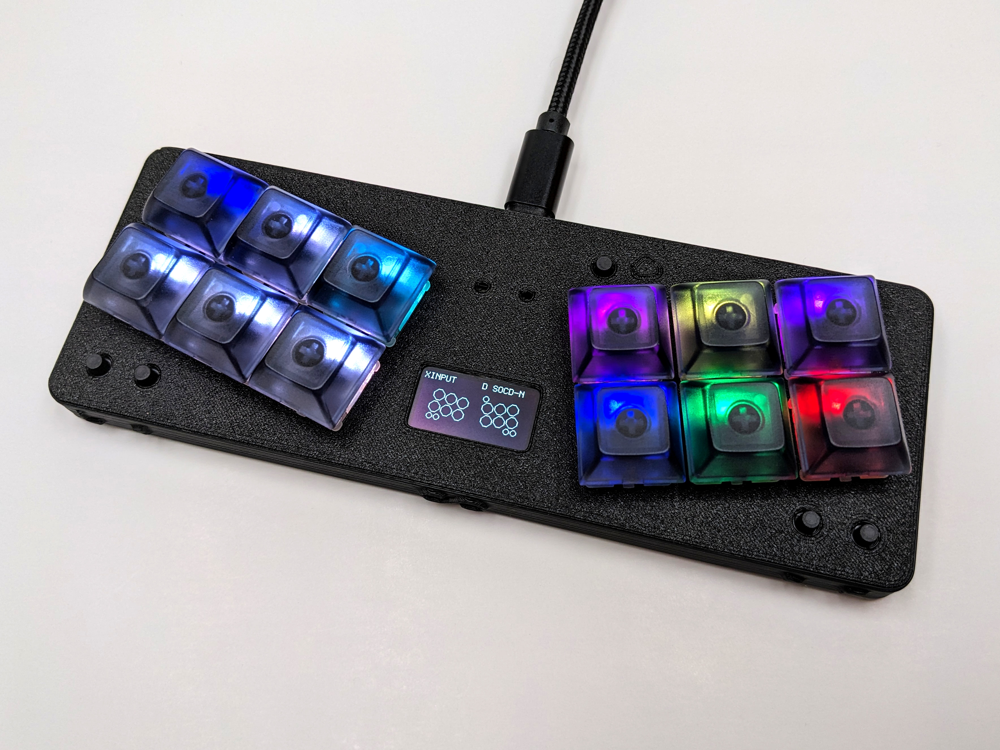
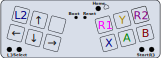
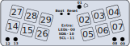

The Springboard is a keyboard-style controller for platformers.

## Why

I wanted to speedrun [Bat to the Heavens](https://store.steampowered.com/app/3044100/Bat_to_the_Heavens/), so I made a controller for it. Normal controllers are comfortable, but they limit you to your thumbs and index fingers. The Springboard (and Fightboard) flatten out the controls and let you use more of your precious fingers.

## Layout

The layout is basically mirrored WASD with the bumpers and triggers in the corners.

## Pinout

If you want to mess around with remapping anything, it can be useful to see the original pinout.

## Firmware

The latest firmware is available in the [Github repository](https://github.com/thnikk/GP2040-CE). I'm currently maintaining a fork for some additional tweaks and features. The upstream project is focused on supporting as many devices as possible more than useful feature updates, so I'll only rebase against newer versions when something useful is added.

### Flashing firmware

The process for flashing new firmware is actually really simple. All you need to do is double-press the reset button and you should see a removable storage device get mounted on your computer called "RPI-RP2". Copy the UF2 file for the Springboard onto the device and it should automatically reboot into the new firmware. If it doesn't, just give it about 30 seconds and unplug/replug it.
