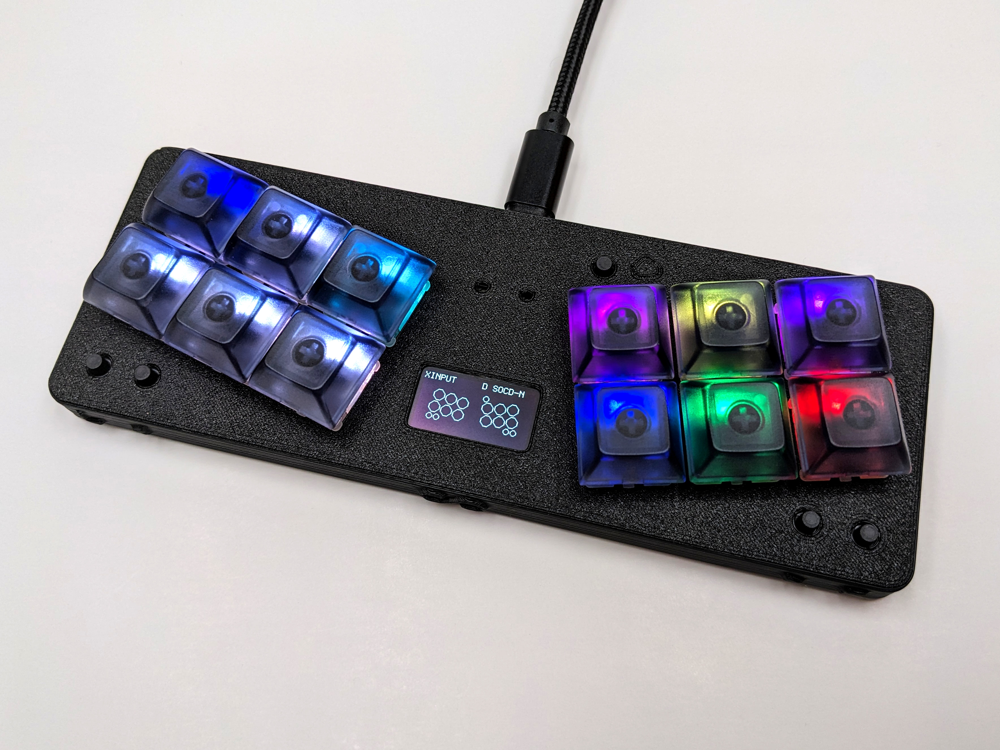
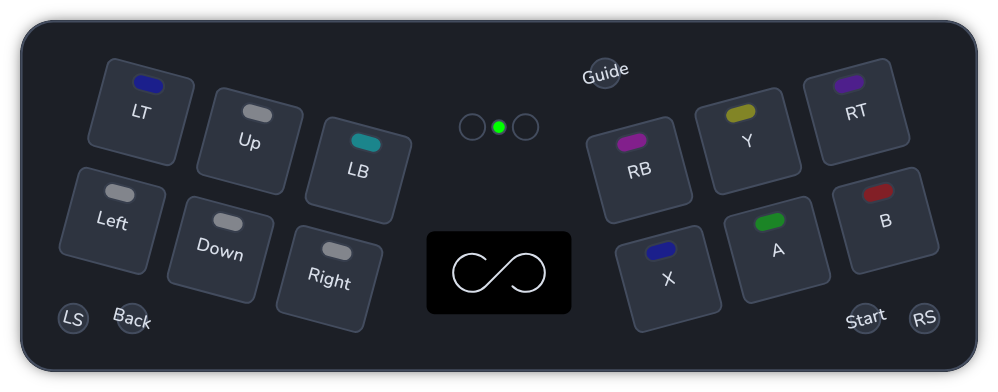

The Springboard is a keyboard-style controller for platformers.

## Why

<video width="100%" controls>
    <source src="videos/btth.mp4" type="video/mp4">
    Your browser does not support the video tag.
</video>

I wanted to speedrun [Bat to the Heavens](https://store.steampowered.com/app/3044100/Bat_to_the_Heavens/), so I made a controller for it. Normal controllers are comfortable, but they limit you to your thumbs and index fingers. The Springboard (and Fightboard) flatten out the controls and let you use more of your precious fingers.

## Layout

The layout is basically mirrored WASD with the bumpers and triggers in the corners.

## Firmware

The Springboard runs on the GP2040-th firmware, which is shared with the Fightboard v3 and v3.1. For details on the firmware, check out the [Firmware page](/controllers/firmware/).
